# DesignOdyssey — HLD, LLD & AI-aware System Design

Interview-ready preparation from **junior (SDE-1 / L3)** through **staff/principal (L6–L8)**. Classic product and infrastructure design plus the AI layer that 2026 loops actually probe.

This document is a **living tracker**, not a book substitute. Use it to sequence work, pick problems at your level, and score mocks. Depth lives in the books, papers, and blogs linked below.

---

## 0. How to use this document

- Copy the **Progress Tracker** (Section 11) into your notes and update it weekly.
- Every concept is tagged:
  - 🟦 **Fundamental** — CAP, consensus, indexing, isolation, SOLID
  - 🟩 **Current practice** — industry consensus that can shift in a few years
  - 🟨 **Vendor / cloud** — AWS/GCP/Azure or product-specific
  - 🟧 **Emerging** — know it exists; over-invest only if the role needs it
- **Never spend more than two weeks on pure theory before a timed mock.** Pattern recognition under time pressure is the skill being graded.
- **Draw a design before you read anyone's answer.** Memorizing answers without a framework fails the first follow-up.
- Some links are **stable domains** (engineering blogs reorganize URLs). Search the site for the post title if a deep link 404s.

### What is actually in this repo

Read the files, not the headings. The rest of the tree is deliberately thinner than this README:

| Path | State |
|---|---|
| `README.md` | **The curriculum.** Everything of substance is here |
| `hld/README.md` | One short FR-vs-NFR note. `hld/src/` is an empty IntelliJ module |
| `lld/README.md` | Stub pointing back to Phase LLD and Section 7. `lld/src/` is empty |
| `mocks/` | Scorecard convention documented; **no scorecards committed yet** |
| `interview-curator/` | Daily reading-list agent run by a GitHub Action; `output/` still empty |
| `.claude/` | Eight built interview agents (Section 14); `.claude/skills/` is still empty |

There are **no worked solutions here and there are not meant to be.** This file sequences work and links to depth; the answers are yours to write before you read anyone else's.

**Three tracks, one core.** The fundamentals are not a prerequisite you finish and leave behind. Every track keeps pulling on them, which is why consistency, partitioning, replication, consensus, caching, queueing, storage engines, networking, concurrency and failure modes stay first-class in Section 4 rather than becoming footnotes to the AI material.

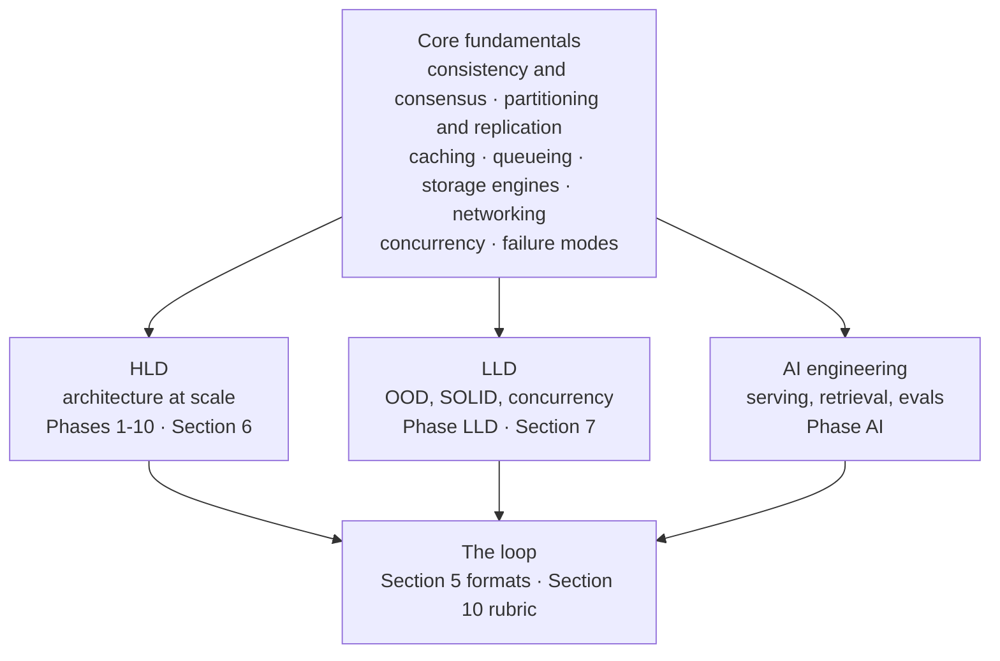

### What interviewers grade in 2026 (all levels)

Across Hello Interview, DesignGurus, interviewing.io write-ups, and company blogs, rubrics cluster on the same four themes (wording differs by company):

1. **Problem navigation** — requirements, scope, assumptions, time management
2. **Solution design** — coherent architecture, data model, APIs, justified scale
3. **Technical excellence** — correct primitives, current tech, trade-offs including **cost**
4. **Communication** — structure, collaboration, driving vs waiting to be led

**What moved since ~2021:** cost reasoning and operational maturity (observability, rollback, on-call) are graded explicitly at senior+. **AI-adjacent literacy** (where a model/retrieval/GPU sits, latency/cost/failure) is expected in general SWE loops when the product has an ML surface — not only in ML-specialist roles. Over-proposing multi-region active-active or event sourcing without a requirement is a **negative** judgment signal.

---

## 1. What this document commits to covering

A roadmap is only worth following if you can tell what it promises. This one promises **sequencing
and coverage** across three tracks and five stages, with every dated claim traceable to a primary
source. It does not promise to replace the books.

### Non-negotiables

These hold at every level, and nothing in Section 4 is allowed to crowd them out:

- The 2026 rubric: trade-offs, capacity math *used* in decisions, cost, ops, driving the room
- PACELC, consistency models, and the Raft / Dynamo / Spanner papers at senior+
- Hands-on work, not only reading: toy Raft, sharded KV, saga, outbox, Resilience4j, OpenTelemetry
- Level calibration (Section 9) and the mock rubric (Section 10) as the way you check yourself
- **Right-sizing the architecture** as a first-class skill, not a caveat
- Fundamentals (🟦) stay first-class. Emerging material (🟧) is added at the edges and never displaces them

### Coverage map

Where each canonical source is actually used, so you can see at a glance whether your prep has a hole:

| Source | Covered in |
|---|---|
| **Alex Xu Vol. 1** | Chapter map in Section 3.1; the 0 → millions ladder, estimation, caching and Snowflake IDs drilled as primitives in Phase 1b; consistent hashing as a *design* in Phase 2; the classic problem set in Section 6 |
| **Alex Xu Vol. 2** | Crux map in Section 3.2; proximity/geo, maps, distributed MQ, metrics, hotel, email, object storage, leaderboard, wallet and stock exchange across Phase 9 and Section 6 |
| **DDIA (Kleppmann)** | Chapter map in Section 3.3; replication, partitioning and consensus in Phases 1–2; encoding and schema evolution in Phase 2 and Phase 10; isolation in Phase 2; unreliable clocks in Phase 1; CDC, column vs row and batch vs stream in Phases 3 and 3b |
| **Levels** | Five stages with entry gates (2.0) and five week-by-week calendars (2.1–2.5) |
| **LLD** | Phase LLD and Section 7: SOLID, UML, patterns by tier, JVM concurrency, boundaries and domain modelling, machine-coding cadence |
| **AI engineering** | Phase AI: basic / intermediate / advanced, plus agents and context engineering, evaluation as a system, and the cost and capacity model |
| **Networking, tenancy, change safety** | Phases 2b, 6b and 10 — the layers that sit under “add a load balancer”, “go multi-region” and “ship the schema change” |
| **Geo, bloom filters, Merkle trees, WAL, erasure coding** | Phases 1b, 2, 6 and 9 |
| **Reliability and operations** | Phases 5, 6b and 7, sourced to the AWS Builders' Library and the Google SRE books (Section 13) |
| **Moving statistics and version claims** | Section 12 only, dated and separately labelled — never inline, where they would rot invisibly |

### Honest limits of any roadmap

Interview reports on Glassdoor/Blind/Hello Interview are **noisy**. Companies rotate questions. This plan covers the **stable primitives** and the **current rotation**. It does not guarantee a specific prompt. Depth on 8–12 designs beats shallow coverage of 40.

---

## 2. Five stages and their calendars

Pick **one** primary track. Do not mix “junior breadth” with “staff papers” in the same week.

| | **Junior / SDE-1** | **Mid / SDE-2** | **Senior** | **Staff / Principal** | **Architect / Principal+** |
|---|---|---|---|---|---|
| Typical titles | Google L3; Amazon SDE-1 ≈ L4 | Google L4; Amazon SDE-2 ≈ L5 | Google L5; Amazon Senior SDE ≈ L6 | Google L6+; Amazon Principal ≈ L7 | Amazon Senior Principal ≈ L8; “Architect” on enterprise ladders |
| HLD in loop? | Often **no** or a light 30-min; **LLD / machine coding** is the design round at many companies (Amazon, Uber, Flipkart, Atlassian, many India product firms) | Usually **one** HLD | One or two HLD; depth + trade-offs | HLD is a **hiring bar** round; you drive scope, cost, org, AI/ops | Often **not a whiteboard**: a review of a system you shipped, a written design doc, cross-org scoping, stakeholder panel |
| Duration @ 8–10 hrs/wk | **14–16 weeks** | **16–20 weeks** | **20–24 weeks** | **22–24 weeks** *or* **10–12 weeks intensive** (~18–20 hrs/wk) | **+8–12 weeks on top of staff** (~6–8 hrs/wk, mostly writing) |
| Books | Xu Vol. 1 Ch. 1–3, 4, 6, 8; primer GitHub | Xu Vol. 1 full; DDIA Ch. 3, 5, 6 | Xu Vol. 1 + selected Vol. 2; DDIA Parts I–II | Both Xu volumes; DDIA full; 4–6 papers | Staff set plus *The Hard Parts* and *Team Topologies*; papers read for judgement, not recall |
| Mocks start | Week 3 (LLD first) | Week 4 | Week 6–8 | Week 3 (intensive) or Week 8 (standard) | Week 1 — the artifact under review is a **document** |
| AI depth | Basic: where LLM/RAG sits, caching, rate limits | Intermediate: hybrid retrieval, evals, cost/token | Intermediate + serving sketch | Advanced: GPU, batching, KV cache, evals, agents as *systems* | Advanced plus portfolio judgement: build vs buy, vendor and model risk, where AI must **not** go |

**Rule for all tracks:** junior candidates who dump Kubernetes + Kafka + Spanner on a parking-lot LLD **fail**. Staff candidates who only recite Xu diagrams without cost/failure **fail**.

### 2.0 Five stages, and the gate between each

The calendars in 2.1–2.5 are *schedules*. This is the **ladder**, and it is what makes the plan
resumable: you do not start at week 1 because the document starts there, you start at the first
gate you cannot pass.

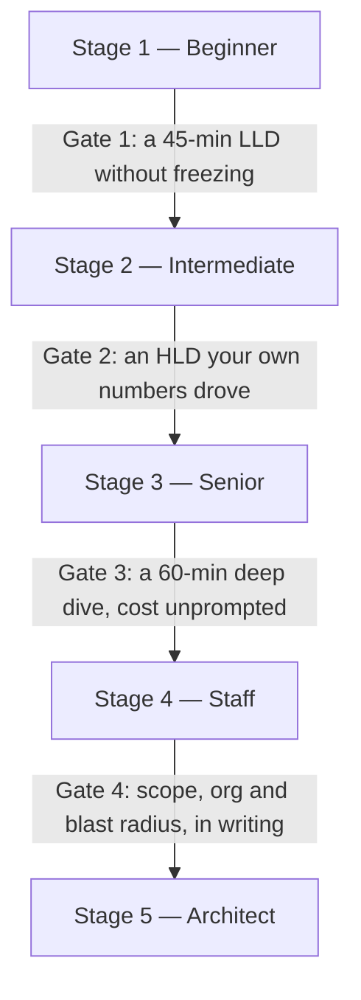

**Find your entry point.** Answer honestly. The first *no* is where you start.

1. Can you run a 45-minute LLD — requirements, a class model, compiling code on the hottest path — without freezing? **No → Stage 1.**
2. Can you take a product prompt to a coherent end-to-end HLD in which a capacity number actually *changed* one of your decisions? **No → Stage 2.**
3. Can you hold one component for 15+ minutes — leader death, an isolation anomaly, a hot partition — and name the failure before you are asked? **No → Stage 3.**
4. Do you state cost, SLOs, rollback and what you would *not* build without being prompted, and scope the problem yourself? **No → Stage 4.**
5. Can you defend a multi-year platform bet in writing — build vs buy, migration sequencing, org boundaries, blast radius — to people who disagree with you? **No → Stage 5.**

Skipping a stage because your title is ahead of your answers is the most common way this plan
fails. Re-reading Stage 1 material because it is comfortable is the second.

#### Stage 1 — Beginner (SDE-1 / L3)

| | |
|---|---|
| **Prerequisite** | One language you can write a class and a test in. Nothing else |
| **Learning order** | Phase 0 → Phase LLD fundamentals (SOLID, Tier-1 patterns) → five LLD classics → concurrency basics → Phase 1b (scale ladder, estimation, caching, IDs) → Phase 2 SQL-vs-NoSQL row only → three foundational problems from Section 6 → Phase AI *basic* |
| **“Done” looks like** | A compiling parking lot with a class diagram; a 45-min HLD on URL shortener or rate limiter finished inside the clock; you can say out loud why you did *not* add Kafka |
| **Interview signal** | Problem navigation and communication (Section 0). Graders are checking that you scope and that you do **not** over-build |
| **Time** | **14–16 weeks @ 8–10 h/wk ≈ 120–150 h** |
| **Why that long** | Only ~60 h of that is reading. The binding constraint is eight LLD builds and three timed HLDs at ~2.5 h each including the rewrite, plus six mocks. Fluency under a clock needs *spaced* repetition; the same 120 h crammed into four weeks does not produce it |

#### Stage 2 — Intermediate (SDE-2 / L4)

| | |
|---|---|
| **Prerequisite** | Gate 1 passed |
| **Learning order** | Phase 1 (skip the papers) → Phase 1b in full → Phase 2 → Phase 2b → Phase 3 (Kafka model + *design a queue*) → Phase 4 → DDIA Ch. 5–6 → six intermediate problems from Section 6 → Phase AI *intermediate* → the mid LLD list |
| **“Done” looks like** | One HLD per week for a month with no notes; storage picked from access patterns in under five minutes; a 90-minute machine-coding build a stranger can clone and run |
| **Interview signal** | Solution design — coherent architecture, a real data model, APIs, scale you justified rather than asserted |
| **Time** | **16–20 weeks @ 8–10 h/wk ≈ 140–190 h** |
| **Why that long** | Concept load roughly doubles to ~95 h (Phases 1–4 plus DDIA 5–6). Six designs *at depth* is the first point where breadth stops being free, and replication and partitioning do not become intuitive in one pass — they need a second encounter inside a design |

#### Stage 3 — Senior (L5)

| | |
|---|---|
| **Prerequisite** | Gate 2 passed. The Stage 2 spine is revision, not new material |
| **Learning order** | Phases 5 → 6 → 6b → 7 → 8 → 10 → DDIA Ch. 3, 4, 7, 8, 9 → two Phase 9 specializations → Phase AI *intermediate* complete plus a serving sketch → 10–12 advanced problems with real depth on eight |
| **“Done” looks like** | A 60-minute deep dive where you name the follow-up before it is asked; every design closes with SLO, rollback, degraded path and one cost sentence; mock average ≥ 3.5 on the Section 10 rubric across six mocks |
| **Interview signal** | Technical excellence and trade-offs **including cost**, plus operational maturity — the two things Section 0 flags as newly explicit since ~2021 |
| **Time** | **20–24 weeks @ 8–10 h/wk ≈ 180–220 h** |
| **Why that long** | ~120 h of concept time *after* discounting the spine to revision, ~50 h of design practice and 14 mocks. The weeks are set by the mock count and by two specializations at 5–8 h each — not by reading speed. This is the stage where the phase menu genuinely exceeds the calendar (see 2.6) |

#### Stage 4 — Staff / Principal (L6–L7)

| | |
|---|---|
| **Prerequisite** | Gate 3 passed, and at least one system you led that you are allowed to describe |
| **Learning order** | Papers (Raft, Dynamo, Spanner, then GFS/TAO) → Phase AI *advanced* → Phases 6b and 10 at full depth → Xu Vol. 2 domain cruxes → adversarial mocks from week 3 |
| **“Done” looks like** | You scope and cut without being asked; you can be wrong about a number and recover in the same breath; three adversarial mocks where the interviewer attacks the design and it either survives or you concede cleanly |
| **Interview signal** | Drives the room; surfaces cost, ops and org first; calibrates to level (Section 9). The bar-raiser question is “above the bar for L6?”, not “good answer?” |
| **Time** | **22–24 weeks @ 8–10 h/wk, or 10–12 weeks @ 18–20 h/wk ≈ 200–240 h** |
| **Why that long** | The intensive is **not a discount** — it is the same hours at double the weekly rate. Compression only works because Stage 3 material is already retrieval rather than learning. If it is not, the 12-week plan collapses around week 5, which is exactly when it stops being recoverable |

#### Stage 5 — Architect (L7–L8 / enterprise architect)

| | |
|---|---|
| **Prerequisite** | Gate 4 passed. A real system, a real migration, and permission to talk about both |
| **Learning order** | Three ADRs on decisions you actually made → one build-vs-buy memo with a TCO model → one multi-year migration plan in Phase 10 vocabulary → cells, tenancy and blast radius (Phase 6b) → org boundaries and Conway (*Team Topologies*) → one “where AI must not go” position paper |
| **“Done” looks like** | A 6–10 page design doc a stranger can review without you in the room; you defend it in a 60-minute panel; you can name the three decisions you would reverse and why |
| **Interview signal** | Judgement over recall. Usually a review of *your* artifact plus stakeholder pressure, rather than “design Twitter” — see the honest limit in 2.5 |
| **Time** | **+8–12 weeks @ 6–8 h/wk ≈ 60–100 h**, on top of Stage 4 |
| **Why that long** | Almost no new theory (~15 h). The hours go into drafting, getting a real reader to disagree, and rewriting. **Feedback latency sets this calendar, not concept load** — you cannot compress someone else's review turnaround |

### 2.1 Junior — 16-week calendar (8–10 hrs/week)

| Weeks | Focus | Outcome |
|---|---|---|
| 1–2 | Interview OS (**Phase 0**), OOP/SOLID, 4 GoF patterns you will actually use | Can run a 45-min LLD without freezing |
| 3–5 | LLD classics: parking lot, LRU, rate limiter, logger, vending machine | Working code + class diagram |
| 6–8 | Concurrency: thread safety, producer-consumer, Java 21 virtual threads *or* language equivalent | Ticket booking / cache under races |
| 9–11 | HLD fundamentals: scale ladder, estimation, caching, SQL vs NoSQL, load balancer, unique IDs, URL shortener, rate limiter | First timed 45-min HLD |
| 12–13 | Feed **or** chat **or** notifications (pick one) | One end-to-end product design |
| 14 | AI basic: RAG chatbot sketch, no GPU deep dive | Know when to retrieve vs generate |
| 15–16 | Mocks + weak spots | 4–6 timed mocks |

### 2.2 Mid — 20-week calendar

Junior plan compressed into weeks 1–8, then: KV store, news feed, chat, notification, web crawler, autocomplete; DDIA Ch. 5–6; **Phase 2b** (one week — it changes how you read every latency number afterwards); one geo **or** metrics design; AI intermediate (hybrid search + evals); mocks from week 4 (1/week) then 2/week in the last month.

### 2.3 Senior — 24-week standard (employed, ~8–10 hrs/week)

| Weeks | Phases |
|---|---|
| 1 | Interview OS + 2026 rubric (Phase 0) |
| 2–4 | Distributed fundamentals incl. locks and fencing tokens; DDIA Ch. 5–9 core ideas (Phase 1, 1b) |
| 5–7 | Data layer + encoding/CDC/isolation (Phase 2) |
| 8 | Networking and transport (Phase 2b) |
| 9–10 | Messaging, streams, outbox, CQRS (Phase 3) |
| 11–12 | APIs, gateways, rate limiting (Phase 4) |
| 13 | Reliability (Phase 5) |
| 14–15 | Multi-region, DR, cost (Phase 6); cells and blast radius (Phase 6b) |
| 16–17 | Observability, deploy, on-call (Phase 7) |
| 18 | Security (Phase 8) |
| 19 | Evolution and change safety (Phase 10) |
| 20–21 | Two specializations (Phase 9: Xu Vol. 2 + AI serving **or** payments **or** storage) |
| Parallel | LLD 2–3 hrs/week; Phase AI basic then intermediate woven across weeks 8–19; one timed mock/week from week 6–8 |
| 22–24 | Mock intensive (**Phase 11**) |

Phase 3b is the cut in this calendar unless the role is data-adjacent — see 2.6. Nothing here
double-books a week on purpose: when specializations and the mock intensive overlap, it is the mocks
that get dropped, and those are the ones that would have told you what to study.

### 2.4 Staff — intensive 12-week (loop scheduled, ~18–20 hrs/week)

Use this when the loop is already booked. The **AI ladder occupies weeks 7–8 in full** rather than as a skim, and **Xu Vol. 2** problems are mixed into the mocks from week 8 so the domain cruxes land under time pressure rather than in reading.

| Week | HLD (main) | LLD (evenings) | Hands-on | Mocks |
|---|---|---|---|---|
| **1** | Interview OS + CAP/PACELC, consistency, Raft | OOD patterns + SOLID | Toy Raft election | Baseline diagnostic |
| **2** | Idempotency, failure detection, indexing, sharding, replication, **unique IDs** | Thread pools, locks vs CAS, virtual threads | Sharded KV + consistent hashing | 1 untimed framework mock |
| **3** | 2PC/Saga, isolation, distributed SQL landscape, **encoding/CDC** | In-memory rate limiter | Saga + compensations | 2 timed (URL shortener, rate limiter) |
| **4** | Kafka/KRaft, EOS, CQRS, event sourcing, outbox, **batch vs stream (DDIA 10–11)** | Movie booking concurrency | Event-sourced order + outbox | 2 timed |
| **5** | API/gateway + reliability + **estimation drills** | Elevator or parking lot | Resilience4j + chaos | 2 timed |
| **6** | Multi-region/DR/cost + OTel/SLOs + cells and blast radius (Phase 6b) | LRU/LFU + thread safety | Failover sim + OTel | 2 HLD + 1 LLD |
| **7** | Security + **AI basic+intermediate** (RAG, hybrid retrieval, evals, cost) | Notification dispatcher | OAuth2 + mTLS | 2 timed (incl. RAG chatbot) |
| **8** | **AI advanced** (LLM serving, batching, KV cache, GPU) + one Xu Vol. 2 (payments **or** object storage **or** metrics) | Distributed cache LLD | Optional: vLLM docs skim | 3 adversarial mocks |
| **9** | Weak spots + geo **or** leaderboard **or** hotel inventory | Chess or Splitwise | — | 3 mocks |
| **10** | Staff polish: drive room, cost/ops/org unprompted; change safety (Phase 10) — migrate one of your own designs | Catch-up LLD | — | 3 incl. 60-min deep dive |
| **11** | Optional: stock exchange / video / multi-region checkout / weight distribution | — | — | 3 mocks |
| **12** | Taper — no new theory | — | — | 1–2 confidence mocks |

If the loop is sooner: drop week 11, then merge 9–10.

### 2.5 Architect / Principal — 10-week overlay (~6–8 hrs/week)

Run this **after** Stage 4, or alongside it if your loop is a senior-plus-architecture hybrid. The
deliverable is documents, so this is a writing calendar, not a reading one.

| Week | Produce | Pressure-test |
|---|---|---|
| 1 | Pick the system you led. One page: context, constraints, what you would change | A peer who was not there must be able to follow it |
| 2–3 | Three ADRs on decisions you actually made, each naming the option you rejected and why | Someone argues hard for the rejected option |
| 4 | Build-vs-buy memo with a TCO model — licence, ops headcount, exit cost, lock-in | Defend the **exit** plan, not the purchase |
| 5–6 | Multi-year migration plan in Phase 10 vocabulary: expand/contract, dual-run, decommission, and the date you *delete* the old thing | Name what blocks the last 10% |
| 7 | Blast radius and tenancy: cells, quotas, deploy waves, worst single failure (Phase 6b) | “What takes down every customer at once?” |
| 8 | Org and contracts: team boundaries, API ownership, who gets paged | Conway pushback — the org you have, not the one you want |
| 9 | Position paper: where AI belongs in this product and where it must **not** | Cost per request, and the failure the user actually sees |
| 10 | 60-minute panel review of the whole packet | Concede cleanly where you are wrong |

**Honest limit:** architect-level loop formats vary far more than any other level, and I could not
verify a stable published rubric for them the way Section 0 cites rubric sources for SWE loops.
Treat this overlay as preparation for *defending decisions in writing* — which every version of
the round tests — rather than as a map of a specific company's process. Judgement call, flagged.

### 2.6 How these timelines were derived

**Assumed weekly hours:** 8–10 for an employed candidate (the default everywhere in this
document), 18–20 for the intensive plans, 6–8 for the Stage 5 overlay. If your number differs,
scale the **weeks**, not the hours — cutting the mock count is what breaks the plan.

Every phase in Section 4 carries an hour estimate in its *Time* column, so a stage's budget is
arithmetic rather than vibes:

```
  concept hours   sum of the Time column for the phases in scope
+ practice        problems x ~2.5 h  (one timed pass, one rewrite)
+ mocks           count x ~1.5 h     (including self-review against Section 10)
+ builds          hands-on
= stage budget    must fit  weeks x weekly hours
```

| Stage | Weeks | h/wk | Band | Concept | Practice | Mocks | Builds | Total |
|---|---|---|---|---|---|---|---|---|
| 1 Beginner | 14–16 | 8–10 | 112–160 h | ~60 h | 11 × 2.5 ≈ 28 h | 6 × 1.5 = 9 h | ~20 h | **~117 h** |
| 2 Intermediate | 16–20 | 8–10 | 128–200 h | ~95 h | 14 × 2.5 = 35 h | 10 × 1.5 = 15 h | ~15 h | **~160 h** |
| 3 Senior | 20–24 | 8–10 | 160–240 h | ~120 h | 20 × 2.5 = 50 h | 14 × 1.5 = 21 h | ~20 h | **~211 h** |
| 4 Staff | 22–24 *or* 10–12 | 8–10 / 18–20 | 176–240 h | ~130 h + 6 h papers | 24 × 2.5 = 60 h | 20 × 1.5 = 30 h | ~15 h | **~241 h** |
| 5 Architect | +8–12 | 6–8 | 48–96 h | ~15 h | — | 1 panel | ~70 h writing | **~87 h** |

The **Concept** column is what remains *after* the cuts listed below and after discounting earlier-stage material to revision. The raw menu is larger — see the next paragraph.

Stages 1, 2 and 5 land mid-band. **Stages 3 and 4 land at the top of theirs** — that is not sloppy
arithmetic, it is the honest answer: a senior at 8 h/week needs 24 weeks, not 20, and a staff
candidate at 8 h/week should not plan 22.

**The phase tables oversubscribe the calendar on purpose.** Add up every *Time* entry in Phases
1–10 and you get **~161 h of concept material** — and that is before Phase AI (~50 h: 34 across the
three tiers, 16 across agents, evals and the cost model), before Phase 9 specializations (5–8 h
each), before the ~6 h of papers, and before a single mock. A senior at 9 h/week for 24 weeks has
~216 h in total, of which LLD takes ~60 h, leaving roughly **115 h of concept budget against 210 h+
of concept material.**

The gap is the point. The phases are a *menu with times attached* so that you cut deliberately
instead of running out of weeks by accident. The standard cuts, in order:

1. **Phase 3b** entirely, unless the role is data-adjacent (−8 h)
2. **One of the two Phase 9 specializations** (−6 h)
3. **The Phase 1 papers** at anything below senior (−6 h)
4. **Phase AI advanced** unless the role touches inference infrastructure (−16 h)
5. **Vendor-tagged rows** (\U0001f7e8) anywhere the company does not use that cloud (−5 h)

That is ~40 h recovered, which is what turns a 210 h menu into a 170 h plan — still above the 115 h
budget, which is why Stage 3 genuinely needs 24 weeks rather than 20 and why the fundamentals
(\U0001f7e6) are the rows you never cut.

**Why each stage is bound by something different** — this is the part bare week counts hide:

- **Stages 1–2 are bound by practice volume, not reading.** Sixty hours of concept fits in seven weeks; you still need 14–16, because the deliverable is fluency under a clock. Eleven builds and ten mocks do not stack into a fortnight.
- **Stage 3 is bound by breadth *with* depth.** Two specializations plus eight designs you can defend is where the menu first exceeds the calendar, hence the cut list above.
- **Stage 4 is bound by adversarial reps.** Twenty mocks, of which the last several must be hostile. You cannot self-generate the follow-up that catches you out; that requires another person and their availability.
- **Stage 5 is bound by feedback latency.** A reader who disagrees with your document turns it around on their schedule, not yours.

**Error bars: ±20%**, and wider if you have never sat a timed mock. Log four weeks of real hours
in the Section 11 tracker, then re-derive your own numbers instead of trusting these.

---

## 3. Map to the three books (and what to skip)

### 3.1 *System Design Interview – An Insider’s Guide* (Alex Xu), Volume 1

Use this for **how to talk in 45 minutes** and for the classic product set. It is not a distributed-systems textbook.

| Chapter | Interview use | Track |
|---|---|---|
| 1 Scale from zero to millions | Vertical/horizontal scale, cache, CDN, DB replica, shard — **must be fluent** | All |
| 2 Back-of-envelope | QPS, storage, bandwidth; **use the numbers later** | Mid+ |
| 3 Framework | Clarify → estimate → design → deep dive | All |
| 4 Rate limiter | Token/leaky/sliding window; Redis | All |
| 5 Consistent hashing | Ring, virtual nodes, rebalance | Mid+ |
| 6 Key-value store | The “mini Dynamo” | Senior+ |
| 7 Unique ID generator | UUID vs ticket vs **Snowflake**; clock skew | **All** |
| 8 URL shortener | Hash, 301 vs 302, bloom, DB | All |
| 9 Web crawler | Frontier, politeness, bloom, DFS vs BFS | Mid+ |
| 10 Notification | Fan-out, queues, APNs/FCM | Mid+ |
| 11 News feed | Fan-out on write vs read | Mid+ |
| 12 Chat | WS vs long poll, presence, message store | Mid+ |
| 13 Search autocomplete | Trie vs cache, ranking | **Mid+** |
| 14 YouTube | Upload, transcode, CDN | Senior+ |
| 15 Google Drive | Metadata vs block, sync | Senior+ |

### 3.2 Volume 2 (Xu & Lam)

Use after Vol. 1. Each chapter is a **domain crux**, not a new framework.

| Chapter | Crux interviewers pull on |
|---|---|
| Proximity service | Geohash / quadtree, load on hot cells |
| Nearby friends | Realtime location, pub/sub, privacy |
| Google Maps | Tiles, routing graph, ETA |
| Distributed message queue | Durability, ordering, delivery, consumer groups |
| Metrics monitoring | Time-series, downsample, alert fan-out |
| Ad click aggregation | Exactly-once-ish counting, λ-architecture / streaming |
| Hotel reservation | Inventory, double-booking, isolation |
| Distributed email | Mailbox sharding, send vs store |
| S3-like object storage | Data vs metadata, erasure coding, durability 11 nines narrative |
| Gaming leaderboard | Sorted sets, sharding hot keys |
| Payment system | Idempotency, ledger, PSP, reconciliation |
| Digital wallet | Strong consistency on balances, dual ledger |
| Stock exchange | Matching engine, determinism, latency |

### 3.3 *Designing Data-Intensive Applications* (Kleppmann)

This is the **why**. Interview prep that only reads Xu is easy to crack with “what happens if the leader dies?”

**Edition note (2026):** Kleppmann + Riccomini **2e** shipped March 2026 ([Kleppmann’s announcement](https://martin.kleppmann.com/2026/03/24/designing-data-intensive-applications-2e.html)). Chapter **numbers and MapReduce emphasis changed**. The table below is **1e**, which is still what most notes, blogs, and interviewers share. If you own 2e, map by *topic name* (replication, partitioning, isolation, streams), not chapter number.

| DDIA | Interview talking points | When to read |
|---|---|---|
| Ch. 1 Reliability, scalability, maintainability | Latency percentiles, operability | All (skim) |
| Ch. 2 Data models | Relational vs document vs graph; query shapes | Mid+ |
| Ch. 3 Storage | **B-tree vs LSM**, WAL, compaction, OLTP vs OLAP, column stores | Mid+ |
| Ch. 4 Encoding | JSON vs Avro/Protobuf, **schema evolution**, compatibility | Senior+ |
| Ch. 5 Replication | Single-leader, multi-leader, leaderless, lag, failover | **All mid+ (highest ROI)** |
| Ch. 6 Partitioning | Key range vs hash, secondary indexes, rebalance, request routing | **All mid+** |
| Ch. 7 Transactions | Isolation levels, lost update, write skew, SSI | Senior+ |
| Ch. 8 Trouble with distributed systems | Unreliable clocks, truth vs majority, network partitions | Senior+ |
| Ch. 9 Consistency & consensus | Linearizability, total order broadcast, Raft/Paxos *ideas* | Senior+ |
| Ch. 10 Batch | MapReduce/Spark as derived data; not “Hadoop trivia” | Senior / data-heavy roles |
| Ch. 11 Stream | Messaging vs log, windows, exactly-once claims | Senior+ |
| Ch. 12 Future | Unbundling DB; CDC as integration | Staff skim |

**Time-boxed DDIA:** If you have one weekend before onsites, read **Ch. 5 and 6 only** (~4–6 hours). Do not attempt the whole book in three days.

**Other books (optional):** *Understanding Distributed Systems* (Costa) for a shorter theory pass; Google SRE book (free) for SLOs/overload; *Designing Machine Learning Systems* (Huyen) if the loop is ML-platform heavy.

**Grokking catalog split:** Original *Grokking the System Design Interview* now lives at [DesignGurus](https://www.designgurus.io/course/grokking-the-system-design-interview) (classic ~15 problems). [Educative’s “Grokking”](https://www.educative.io/courses/grokking-the-system-design-interview) is a **diverged** catalog (Maps, ChatGPT, etc.). Do not treat them as the same course.

---

## 4. Phase-by-phase roadmap

Phases are a dependency graph, not a queue. The **spine** below is ordered because each phase
assumes the previous one; everything in the second diagram can be reordered or cut against the
budget in 2.6.

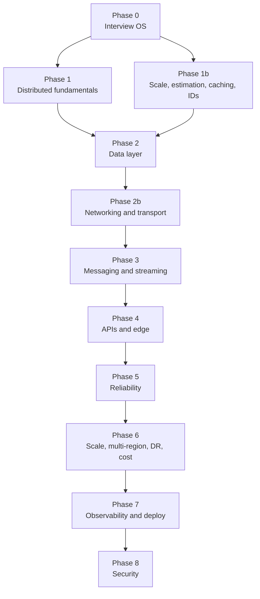

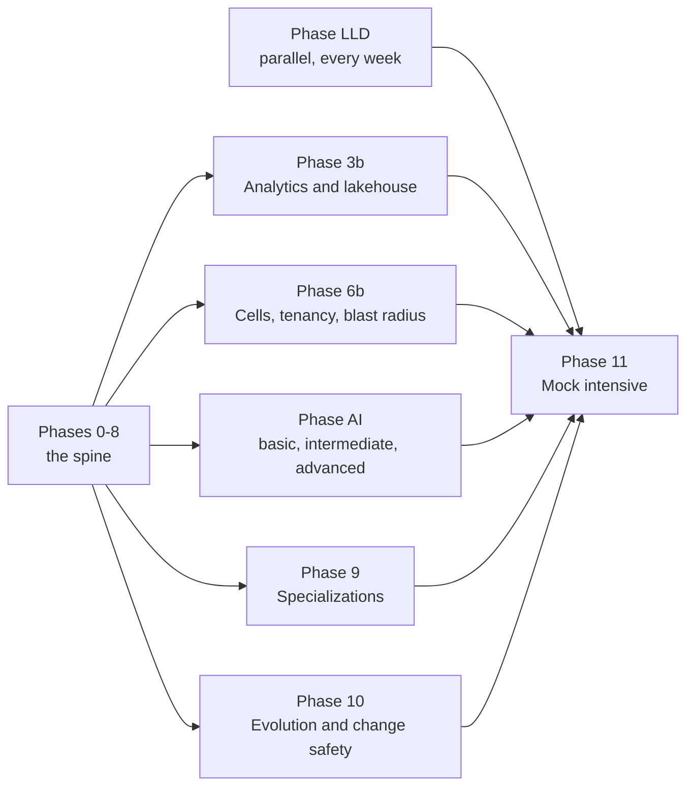

### Phase 0 — Interview operating system (Week 1 of every track)

**Outcome:** You can run the framework from memory. You stop giving 2019-era “just add Kafka” answers.

**7-step framework (use this every HLD mock):**

1. **Clarify & scope** (functional + non-functional). State assumptions. Cut scope out loud.
2. **Back-of-envelope** (users, QPS, storage, bandwidth, machines). Write units.
3. **APIs** (or events). Idempotency, pagination, error model.
4. **Data model** (entities, access patterns, partition key, indexes).
5. **High-level diagram** (clients → edge → services → data stores → async).
6. **Deep dives** (1–2 bottlenecks the interviewer cares about).
7. **Failure, ops, cost, evolution** (degraded path, SLO, rollback, $). Senior+ do this **unprompted**.

Xu’s published framework is 4 steps (clarify, estimate, design, deep dive). The extra three are what 2026 senior+ loops actually grade. In a **30-minute** screen, collapse 2 and 7.

**Do this week:** Write the 7 steps on one page. Read 3 recent debriefs for *your* target companies (Hello Interview question DB, team blogs — not only Glassdoor).

---

### Phase 1 — Distributed systems fundamentals

**Outcome:** Derive trade-offs; do not recite CAP as “choose two.”

| Concept | Type | Time | Why interviews | Resource |
|---|---|---|---|---|
| CAP (and common mis-statements) | 🟦 | 1.5 h | Every DB answer | [Jepsen analyses](https://jepsen.io/analyses) — skim 2–3 DBs you know |
| PACELC | 🟦 | 1 h | Latency vs consistency when *no* partition | Search: Abadi PACELC (2010) |
| Consistency models | 🟦 | 2.5 h | “How consistent does this *need* to be?” | [Jepsen consistency](https://jepsen.io/consistency) |
| Consensus, Raft, quorum W+R>N | 🟦 | 4 h | etcd, KRaft, locks | [raft.github.io](https://raft.github.io/) |
| Clocks: Lamport, vector, HLC, NTP failure | 🟦 | 2 h | Conflicts, Snowflake, Spanner | Dynamo §versioning; DDIA Ch. 8 |
| Gossip, phi-accrual, membership | 🟩 | 1 h | Discovery, Cassandra-style | Hayashibara phi-accrual paper (search) |
| Idempotency & delivery semantics | 🟦 | 1.5 h | Payments, queues | [Stripe — idempotency](https://stripe.com/blog/idempotency) |
| Unreliable networks / partial failure | 🟦 | 1 h | Staff follow-ups | DDIA Ch. 8 |
| Distributed locks, leases, **fencing tokens** | 🟦 | 1.5 h | The classic staff follow-up: “what if the lock holder GC-pauses past the TTL?” | [Kleppmann — how to do distributed locking](https://martin.kleppmann.com/2016/02/08/how-to-do-distributed-locking.html) |
| Leader election in practice: etcd/ZooKeeper vs DIY | 🟩 | 1 h | “Who decides?” in every HA answer | etcd docs — lease and election API |

**Papers (senior+; ~5–8 h):**

- [Raft paper](https://raft.github.io/)
- [Dynamo (SOSP 2007)](https://www.allthingsdistributed.com/files/amazon-dynamo-sosp2007.pdf)
- [Spanner](https://research.google/pubs/spanner-googles-globally-distributed-database-2/) (or the [OSDI 2012 PDF](https://www.usenix.org/system/files/conference/osdi12/osdi12-final-16.pdf)) — TrueTime
- Supplementary: [GFS](https://pdos.csail.mit.edu/6.824/papers/gfs.pdf), [TAO (USENIX ATC 2013)](https://www.usenix.org/system/files/conference/atc13/atc13-bronson.pdf)

**Hands-on:** Toy Raft leader election (~200 lines). Junior: skip implementation; watch the Raft visualization.

---

### Phase 1b — Scale ladder, estimation, caching, IDs

| Concept | Type | Time | Resource |
|---|---|---|---|
| Scale from 1 user → millions (Xu Ch. 1) | 🟦 | 3 h | Xu Vol. 1 Ch. 1; [system-design-primer](https://github.com/donnemartin/system-design-primer) |
| Back-of-envelope (Xu Ch. 2) | 🟦 | 2 h | Powers of 2, latency numbers; [Jeff Dean / Colin Scott numbers](https://gist.github.com/jboner/2841832) (order-of-magnitude, not gospel) |
| Cache hierarchy: client, CDN, app, Redis, DB | 🟦 | 2 h | Invalidation, stampede, TTL vs write-through vs write-back |
| Bloom filters, HyperLogLog, Count-Min | 🟦 | 1.5 h | Crawler URL seen-set; cardinality |
| Merkle trees / anti-entropy | 🟦 | 1 h | Dynamo; object storage integrity |
| Unique IDs: UUID, DB ticket, Snowflake | 🟦 | 2 h | Xu Vol. 1 Ch. 7; clock monotonicity |

**The ladder, in the order you should say it.** Each rung is a response to a *named* bottleneck.
Naming the bottleneck is the graded part; the rung is the easy part.

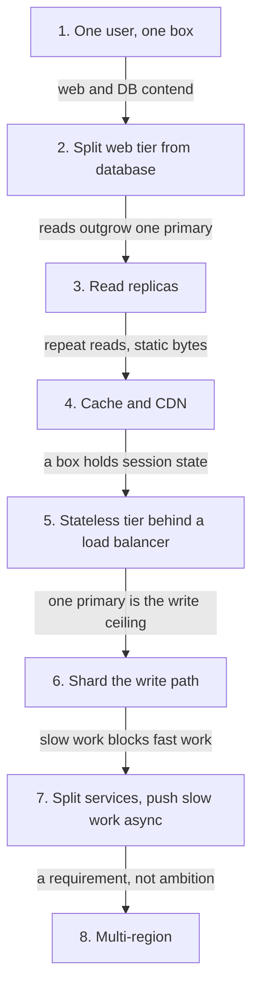

Rung 8 without a stated requirement is a **negative** signal, not an advanced one (Section 0).

---

### Phase 2 — Data layer

**Outcome:** Pick storage from **access patterns** in under five minutes.

| Concept | Type | Time | Resource |
|---|---|---|---|
| SQL vs NoSQL by query, not fashion | 🟦 | 1.5 h | Drill on 5 problems from Section 6 |
| B-tree vs LSM, WAL, compaction, write amp | 🟦 | 3 h | [PostgreSQL index types](https://www.postgresql.org/docs/current/indexes-types.html); RocksDB wiki (LSM) |
| Isolation levels, write skew | 🟦 | 2 h | DDIA Ch. 7; hotel/booking designs |
| Sharding: range, hash, consistent hash, directory; reshard | 🟦 | 3 h | [Stanford CS168 consistent hashing notes](https://web.stanford.edu/class/cs168/l/l1.pdf) |
| Replication topologies | 🟦 | 2 h | Dynamo + [PostgreSQL HA](https://www.postgresql.org/docs/current/high-availability.html) |
| 2PC, Saga, TCC, outbox | 🟦 | 3 h | [microservices.io Saga](https://microservices.io/patterns/data/saga.html) |
| CDC | 🟩 | 1 h | Debezium mental model; DDIA Ch. 11–12 |
| Distributed SQL / NewSQL | 🟨/🟧 | 2 h | [Cockroach architecture](https://www.cockroachlabs.com/docs/stable/architecture/overview) |
| Search (inverted index) vs OLTP | 🟩 | 1.5 h | Elasticsearch reference — inverted index |
| Time-series / metrics stores | 🟩 | 1 h | Xu Vol. 2 metrics chapter ideas; Prometheus/VictoriaMetrics docs (skim) |
| Object storage vs file vs block | 🟦 | 1.5 h | Xu Vol. 2 S3 chapter; GFS paper |
| Vector / hybrid search | 🟧→🟩 | 2 h | pgvector docs; Phase AI |

**2026 note:** Distributed SQL is mature in lanes (Cockroach/Yugabyte Postgres-compat multi-region; TiDB MySQL+HTAP; Spanner GCP). The common production *and interview* mistake is adopting it before single-region Postgres/MySQL + replicas + boring sharding is insufficient. Say that out loud.

**2026 note — say “Redis or Valkey”, not just “Redis”:** Redis Ltd. relicensed away from BSD in
March 2024; within a week the Linux Foundation launched **Valkey**, a BSD-3 fork of Redis 7.2.4
backed by AWS, Google Cloud, Oracle, Ericsson and Snap. Redis Ltd. then added **AGPLv3** as an
option from Redis 8.0 in May 2025. Practical consequence for a design answer: the protocol and the
data structures you are reasoning about are the same, but “managed Redis” on a major cloud is
increasingly Valkey underneath, and some legal teams will not take AGPL. Naming that distinction is
a cheap, current signal — pretending the fork did not happen is a dated one. See Section 12.

**Blogs:** [Uber Schemaless](https://www.uber.com/blog/schemaless-part-one-mysql-datastore/) (search if URL moves); [Vitess](https://vitess.io/docs/); Meta TAO paper above.

**Hands-on (mid+):** Docker Compose sharded KV: consistent hashing, leader replication, heartbeat, 3-step saga.

---

### Phase 2b — Networking and the transport layer

**Why this phase exists:** load balancers and CDNs sit on top of a layer most candidates never
learned, and “why is p99 bad while p50 is fine?” is answered down there far more often than in the
application. Every number in Phase 1b estimation is ultimately a network number.

**Outcome:** you can explain what a request physically does between the client and your service,
and which hop your tail latency is hiding in.

| Concept | Type | Time | Why interviews | Resource |
|---|---|---|---|---|
| DNS, TTLs, anycast, GSLB | \U0001f7e6 | 1 h | Failover that is actually DNS-bound; “how long until traffic moves?” | [Cloudflare Learning — DNS](https://www.cloudflare.com/learning/dns/what-is-dns/) |
| TCP handshake, congestion control, head-of-line blocking | \U0001f7e6 | 2 h | Why a far-away region costs RTTs, not just “latency” | [High Performance Browser Networking](https://hpbn.co/) Ch. 2–4 |
| TLS handshake, session resumption, mTLS cost | \U0001f7e6 | 1 h | Per-connection cost; why you pool | HPBN Ch. 4; Phase 8 |
| HTTP/1.1 vs HTTP/2 vs **HTTP/3 (QUIC)** | \U0001f7e9 | 1.5 h | Multiplexing, 0-RTT, mobile networks | [RFC 9114](https://www.rfc-editor.org/rfc/rfc9114.html); [Cloudflare on HTTP/3](https://blog.cloudflare.com/http3-the-past-present-and-future/) |
| Connection pooling, keep-alive, file descriptors | \U0001f7e6 | 1 h | The bottleneck behind “just add servers” | HPBN; your driver's pool docs |
| Timeout **budgets** across hops | \U0001f7e6 | 1 h | A retry storm is a timeout-budget bug | [gRPC deadlines](https://grpc.io/docs/guides/deadlines/); Phase 5 |
| Long-lived transports: WebSocket, SSE, long poll | \U0001f7e6 | 1.5 h | Chat, presence, **LLM token streaming** | Xu Vol. 1 Ch. 12; Phase AI |

**Drill:** take one design you have already done and annotate every arrow with a protocol, a
timeout, and who retries. Most designs fall apart at “who retries?”

---

### Phase 3 — Messaging, streaming, derived data

| Concept | Type | Time | Resource |
|---|---|---|---|
| Kafka: partitions, ISR, RF, min.insync.replicas | 🟦 | 2 h | [Kafka docs](https://kafka.apache.org/documentation/) Design + Implementation |
| KRaft (ZK removed in 4.0) | 🟩 | 2 h | [Kafka 4.0 announcement](https://kafka.apache.org/blog/2025/03/18/apache-kafka-4.0.0-release-announcement/); [KRaft guide](https://developer.confluent.io/learn/kraft/); KIP-500 |
| EOS (idempotent producer + txn API) | 🟦 | 1.5 h | Kafka transactions docs |
| Consumer rebalance: cooperative sticky, then **KIP-848** | 🟩 | 1.5 h | [KIP-848](https://cwiki.apache.org/confluence/x/HhD1D) — broker-side coordination, GA in 4.0, opt-in; classic protocol deprecated in 4.3 |
| CQRS, event sourcing, snapshotting | 🟦 | 2–2.5 h | Fowler CQRS; Azure CQRS/ES; [microservices.io ES](https://microservices.io/patterns/data/event-sourcing.html) |
| Transactional outbox | 🟦 | 1.5 h | [Outbox pattern](https://microservices.io/patterns/data/transactional-outbox.html) |
| Backpressure | 🟦 | 1.5 h | [Reactive Streams](https://www.reactive-streams.org/) |
| Batch vs stream (DDIA 10–11) | 🟦 | 2 h | When Spark/Flink vs Kafka Streams |
| Design a **message queue** (not only “use Kafka”) | 🟦 | 3 h | Xu Vol. 2 Ch. 4 |

**Verified:** Kafka is KRaft-only from 4.0 (18 Mar 2025); the current line is **4.2 (17 Feb 2026)**
and **4.3 (22 May 2026)**. ZK clusters migrate via the 3.9 bridge *before* 4.x, and production runs
dedicated controllers. Two things commonly date a candidate here: ZK-era war stories told
untranslated, and the rebalance vocabulary — **KIP-848** moved coordination to the broker, is GA
from 4.0 but still opt-in, and 4.3 deprecated the classic protocol with the default switch targeted
at 5.0. On a 4.x cluster, say “server-side assignor”, not “stop-the-world rebalance”. See Section 12.

**Blogs:** [Netflix Keystone](https://netflixtechblog.com/keystone-real-time-stream-processing-platform-a3ee651812a); [LinkedIn Engineering](https://www.linkedin.com/blog/engineering) (Kafka origin); Confluent KRaft guide.

---

### Phase 3b — Analytics, warehouse, lakehouse (first cut if short on time)

**Why this phase exists:** DDIA Ch. 10–11 teach batch and stream as *derived data*; this phase is
where that data actually lands. Ad-click aggregation, metrics, recsys features and every “and then
the analysts query it” follow-up live here. It is also the phase to **cut first** at senior and below
unless the role is data-adjacent (see 2.6).

| Concept | Type | Time | Why interviews | Resource |
|---|---|---|---|---|
| Row vs column layout; why OLAP is a different engine | \U0001f7e6 | 1.5 h | “Can we just query the replica?” — usually no | DDIA Ch. 3 (column storage) |
| Warehouse vs lake vs **lakehouse**; who owns the schema | \U0001f7e9 | 1.5 h | Where the second copy of your data lives | [Databricks on the open lakehouse](https://www.databricks.com/blog/next-era-open-lakehouse-apache-icebergtm-v3-public-preview-databricks) |
| Open table formats: **Apache Iceberg**, snapshots, time travel | \U0001f7e9 | 1.5 h | The 2026 default answer for the analytical copy | [Iceberg spec](https://iceberg.apache.org/spec/) — read the table/snapshot model, skip the rest |
| Stream → table: Flink, Kafka Streams, materialized views | \U0001f7e6 | 1.5 h | Ad-click aggregation, leaderboards, metrics rollups | Xu Vol. 2 ad-click chapter; Flink docs concepts |
| Real-time OLAP serving: ClickHouse / Druid / Pinot shape | \U0001f7e9 | 1 h | “Dashboard must be fresh within a minute” | ClickHouse docs — MergeTree concepts |
| Idempotent aggregation, late data, watermarks | \U0001f7e6 | 1 h | The honest answer to “exactly once” counting | DDIA Ch. 11 |

**2026 note:** Iceberg **v3** (deletion vectors, row lineage, a `VARIANT` type) went GA across
Snowflake, Databricks and S3 Tables during 2026, and open engines now treat Iceberg as the default
table format. The interview-relevant consequence is small but real: the analytical copy of your data
is a *table with snapshots*, not a directory of Parquet files, so “we reprocess from the lake” now
has version semantics you can name. Dated claim — see Section 12.

---

### Phase 4 — APIs and edge

| Concept | Type | Time | Resource |
|---|---|---|---|
| REST maturity, versioning, cursor pagination, idempotency keys | 🟦 | 2 h | [Stripe idempotency](https://stripe.com/blog/idempotency); [Stripe API versioning](https://stripe.com/blog/api-versioning) |
| GraphQL vs REST vs gRPC | 🟦 | 1.5 h | [gRPC intro](https://grpc.io/docs/what-is-grpc/introduction/); [GraphQL learn](https://graphql.org/learn/) |
| BFF | 🟩 | 0.5 h | [Sam Newman BFF](https://samnewman.io/patterns/architectural/bff/) |
| Gateway: authn/z, rate limit, shape, protocol | 🟦 | 1.5 h | [Kong concepts](https://docs.konghq.com/gateway/latest/); [Envoy overview](https://www.envoyproxy.io/docs/envoy/latest/intro/arch_overview/arch_overview) |
| Kubernetes Gateway API | 🟩 | 2 h | [Gateway API](https://kubernetes.io/docs/concepts/services-networking/gateway/) |
| Mesh vs gateway (N-S vs E-W) | 🟦 | 1 h | Istio “what is Istio”; **when not to mesh** |
| Rate limiter algorithms (distributed) | 🟦 | 2 h | [Stripe rate limiters](https://stripe.com/blog/rate-limiters); Xu Ch. 4 |
| Streaming responses: SSE vs WebSocket vs chunked | 🟦 | 1 h | Token streaming, progress, cancellation; Phase 2b |
| Contract testing and consumer-driven contracts | 🟩 | 1 h | Pact docs — how the API survives Phase 10 |
| AI/LLM gateway (token meter, route, cache) | 🟧 | 1 h | Kong/Envoy AI gateway docs — shape only unless AI-infra role |

---

### Phase 5 — Reliability

| Concept | Type | Time | Resource |
|---|---|---|---|
| Circuit breaker, bulkhead | 🟦 | 1.5 h | Resilience4j docs *or* equivalent |
| Retry + full jitter | 🟦 | 1 h | [Timeouts, retries and backoff with jitter](https://aws.amazon.com/builders-library/timeouts-retries-and-backoff-with-jitter/) |
| Deadline / timeout budgets | 🟦 | 1 h | [gRPC deadlines](https://grpc.io/docs/guides/deadlines/) |
| Load shedding, priority, overload | 🟦 | 1 h | [SRE book — overload](https://sre.google/sre-book/handling-overload/); [AWS on load shedding](https://aws.amazon.com/builders-library/using-load-shedding-to-avoid-overload/) |
| Graceful degradation | 🟩 | 1 h | Practice: name the user-visible fallback |
| Chaos basics | 🟩 | 1 h | [principlesofchaos.org](https://principlesofchaos.org/) |
| **Shuffle sharding** (isolate a bad tenant without N stacks) | 🟦 | 1 h | [AWS Builders' Library](https://aws.amazon.com/builders-library/workload-isolation-using-shuffle-sharding/) |
| Constant work: no bimodal behaviour under stress | 🟦 | 1 h | [Reliability and constant work](https://aws.amazon.com/builders-library/reliability-and-constant-work/) |
| When **fallback makes it worse** | 🟦 | 1 h | [Avoiding fallback in distributed systems](https://aws.amazon.com/builders-library/avoiding-fallback-in-distributed-systems/) |
| Cache failure modes: stampede, poisoning, cold start | 🟦 | 1 h | [Caching challenges and strategies](https://aws.amazon.com/builders-library/caching-challenges-and-strategies/) |

Interviewers now ask **what the user sees**, **why that threshold**, and **how you test fallback without taking prod down**.

---

### Phase 6 — Scale, multi-region, DR, cost

| Concept | Type | Time | Resource |
|---|---|---|---|
| LB algorithms; L4 vs L7 | 🟦 | 2.5 h | Matt Klein load balancing post (search); Envoy L3/L4 vs L7 |
| CDN, invalidation, edge | 🟦/🟩 | 1.5 h | [Cloudflare Learning — CDN](https://www.cloudflare.com/learning/cdn/what-is-a-cdn/) |
| Active-passive vs active-active, residency | 🟦 | 2 h | AWS Architecture Blog (search multi-region) |
| RPO/RTO | 🟦 | 1.5 h | AWS Well-Architected Reliability |
| Cost-aware scaling | 🟩 | 1 h | Well-Architected Cost Optimization |
| Geo: geohash, quadtree, S2 | 🟦 | 2 h | Xu Vol. 2 proximity; Uber H3 blog (search) |

Cost is a **graded line** at senior+. Unjustified global active-active is a miss.

---

### Phase 6b — Cells, tenancy, and blast radius

**Why this phase exists:** “multi-region” answers *where* capacity lives. It does not answer *how
big the worst failure is*. Blast radius is the question a bar raiser reaches for when the
architecture is already fine, and it is the difference between a senior and a staff answer to “what
happens when this breaks?”

**Outcome:** you can state, for your own design, the largest set of users a single failure or a
single bad deploy can take out — and what you would change to shrink it.

| Concept | Type | Time | Why interviews | Resource |
|---|---|---|---|---|
| **Cell-based architecture**: full stacks, thin router | \U0001f7e6 | 2 h | The standard answer to “shrink blast radius” | [AWS — reducing scope of impact with cells](https://docs.aws.amazon.com/wellarchitected/latest/reducing-scope-of-impact-with-cell-based-architecture/reducing-scope-of-impact-with-cell-based-architecture.html) |
| Multi-tenancy: pooled vs siloed vs bridge | \U0001f7e6 | 1.5 h | SaaS designs; “how do you stop one tenant hurting the rest?” | Phase 5 shuffle sharding; AWS SaaS lens |
| Quotas and fair queueing per tenant | \U0001f7e6 | 1 h | The noisy-neighbour follow-up; token quotas in Phase AI | Phase 4 rate limiting |
| Deploy waves, cell-at-a-time rollout, bake time | \U0001f7e9 | 1 h | A bad deploy is the most common outage cause | Phase 7 canary |
| Control plane vs data plane; static stability | \U0001f7e6 | 1.5 h | “Does the data plane keep serving if the control plane is down?” — the answer should be yes | [Static stability using availability zones](https://aws.amazon.com/builders-library/static-stability-using-availability-zones/) |

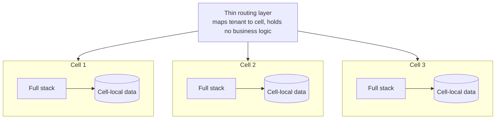

The router is the whole trick and the whole risk: it must be simple enough that it almost never
fails, because it is the one component whose blast radius is still **everything**.

**Drill:** for a design you have already done, answer in one sentence each — what fraction of users
does one bad deploy reach, one corrupt cache entry, one exhausted connection pool, one tenant
sending 100× its normal traffic?

---

### Phase 7 — Observability and deploy

| Concept | Type | Time | Resource |
|---|---|---|---|
| Logs, metrics, traces | 🟦 | 1.5 h | [OTel primer](https://opentelemetry.io/docs/concepts/observability-primer/) |
| OpenTelemetry | 🟩 | 3 h | [opentelemetry.io/docs](https://opentelemetry.io/docs/); [CNCF graduation](https://www.cncf.io/announcements/2026/05/21/cloud-native-computing-foundation-announces-opentelemetrys-graduation-solidifying-status-as-the-de-facto-observability-standard/) |
| SLI/SLO/error budgets | 🟦 | 2 h | [SRE workbook — SLOs](https://sre.google/workbook/implementing-slos/) |
| Golden signals | 🟦 | 0.5 h | [SRE book — monitoring](https://sre.google/sre-book/monitoring-distributed-systems/) |
| Profiling (4th signal) | 🟧 | 0.5 h | OTel profiling — skim |
| Blue-green, canary, flags, rollback | 🟦 | 1.5 h | Fowler BlueGreen; K8s rolling update |
| On-call as a design constraint | 🟩 | 1 h | [SRE — being on-call](https://sre.google/sre-book/being-on-call/) |
| Mesh choice | 🟨/🟧 | 1.5 h | Istio ambient; Cilium mesh — **warrant vs overhead** |

---

### Phase 8 — Security architecture

| Concept | Type | Time | Resource |
|---|---|---|---|
| AuthN vs AuthZ, session vs token | 🟦 | 1 h | [Auth0 — authn vs authz](https://auth0.com/docs/get-started/identity-fundamentals/authentication-and-authorization) |
| OAuth2, OIDC, JWT pitfalls | 🟦 | 3 h | [oauth.net/2](https://oauth.net/2/); [OIDC](https://openid.net/connect/) |
| Zero Trust | 🟩 | 1 h | [NIST SP 800-207](https://csrc.nist.gov/pubs/sp/800/207/final) |
| mTLS, secrets (KMS/Vault) | 🟩 | 1.5 h | Vault docs overview |
| API security | 🟦 | 1 h | [OWASP API Security Top 10](https://owasp.org/API-Security/) |
| Encryption, PII, tokenization | 🟦 | 1 h | OWASP Cryptographic Storage cheat sheet |
| Prompt injection, data exfil via LLM | 🟧 | 1 h | OWASP LLM Top 10 — Phase AI |

---

### Phase AI — AI engineering ladder (integrated with HLD)

Treat this as **systems design with a probabilistic, expensive component**, not as ML theory. You do **not** need to derive attention math. You **do** need latency, cost, failure, eval, and data flow.

#### Basic — ~6 h (every mid+ SWE in 2026; junior if the company ships AI)

- Where the model sits: synchronous API vs async jobs vs streaming tokens
- RAG at box level: ingest → chunk → embed → index → retrieve → prompt → generate → return
- Why **not** dump the whole corpus into the prompt (context limits, cost, recency)
- Caching: **exact** response hash vs **semantic** nearest-neighbor (wrong-match risk) vs **prefix/KV cache** (same token prefix, *new* completion — OpenAI/Anthropic prompt caching). These are three different mechanisms.
- Rate limits and tenant quotas in **tokens**, not only QPS
- Fallback: smaller model, keyword search, “I don’t know”, human handoff
- PII: what must not go to a third-party LLM

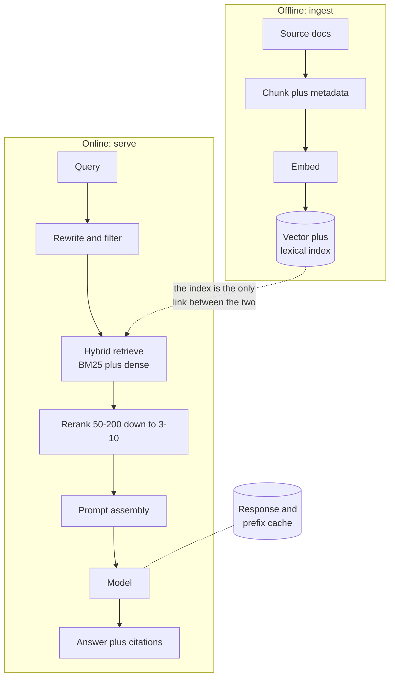

The two boxes interviewers actually push on are **Chunk plus metadata** (because retrieval quality
is decided there, not in the model) and **Answer plus citations** (because without citations you
have no way to tell a good answer from a confident one).

**Resources:** [Hello Interview — ML / system design tracks](https://www.hellointerview.com/learn/system-design/in-a-hurry/introduction); OpenAI / Anthropic API docs (rate limits, caching if offered); [OWASP Top 10 for LLM apps](https://owasp.org/www-project-top-10-for-large-language-model-applications/).

#### Intermediate — ~12 h (senior generalist; mid at AI-product companies)

- Chunking, overlap, metadata filters **before** ANN; **hybrid BM25 + dense**, RRF (typical \(k=60\)), cross-encoder rerank of ~50–200 → 3–10 chunks
- Embedding model versioning (index rebuild when the model changes)
- Eval: golden set, retrieval recall@k, answer faithfulness; LLM-as-judge with a human-labeled subset
- RAG vs fine-tune vs prompt vs LoRA — decision from **data volatility and task**
- Online vs offline indexes; staleness SLA
- Feature store / embedding pipeline (batch + nearline) — [Uber Michelangelo](https://www.uber.com/blog/michelangelo-machine-learning-platform/) and [generative follow-up](https://www.uber.com/blog/from-predictive-to-generative-ai/)
- Guardrails: input/output filters, tool-call allowlists
- Observability: traces around retrieval + generation; cost per request

**Vector store pick (heuristic, not a benchmark):** [pgvector](https://github.com/pgvector/pgvector) if Postgres + mid scale + SQL FTS; Pinecone/Weaviate when you want managed hybrid; Milvus at large N / more ops; [FAISS](https://github.com/facebookresearch/faiss) is a **library**, you own HA. Filtered ANN is the hard part.

**Resources:** [vLLM PagedAttention](https://vllm.ai/blog/2023-06-20-vllm); [Anthropic contextual retrieval](https://www.anthropic.com/engineering/contextual-retrieval); [OpenAI prompt caching](https://openai.com/index/api-prompt-caching/).

#### Advanced — ~16 h (staff, ML platform, inference infra, frontier-lab adjacent)

- Prefill vs decode; **continuous batching**; **KV cache**; PagedAttention; prefix/prompt cache
- Quantization (FP8/INT8/AWQ etc.) as a **latency/quality/cost** lever, not a buzzword
- Speculative decoding: **latency at low batch**, can *hurt* a saturated GPU (not a throughput silver bullet)
- Prefill/decode **disaggregation** (DistServe-class): different hardware/SLOs; KV transfer; cold start is **minutes**
- GPU packing, multi-tenant fairness; autoscale on **queue depth + KV occupancy**, not CPU HPA
- Model **router** (one call) vs **cascade** (small then escalate — FrugalGPT-shaped; high escalate-rate kills savings)
- Distributing **weights** (Xu-style “huge file to thousands of machines”)
- Agents: tool calling, loops, MCP as an integration pattern — **scope and kill-switch**, not a 20-agent diagram
- Safety evals, prompt injection as an authz problem

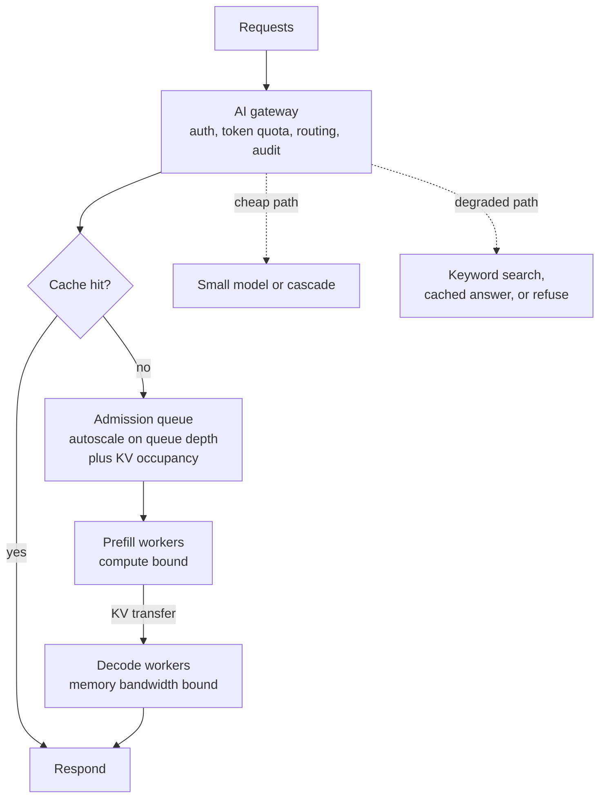

Two things make this a staff answer rather than a diagram: the autoscale signal is **queue depth
and KV occupancy**, not CPU, and the dotted paths exist *before* they are asked for. Prefill/decode
split is worth proposing only when you can say which SLO it buys — TTFT or inter-token latency —
and that KV transfer is now on your critical path.

**Resources:** [vLLM anatomy (2025)](https://vllm.ai/blog/2025-09-05-anatomy-of-vllm); [Anyscale continuous batching](https://www.anyscale.com/blog/continuous-batching-llm-inference); [Netflix in-house LLM serving](https://netflixtechblog.com/in-house-llm-serving-at-netflix-a5a8e799ea2c); [Meta inference parallelism (2025)](https://engineering.fb.com/2025/10/17/ai-research/scaling-llm-inference-innovations-tensor-parallelism-context-parallelism-expert-parallelism/); [DistServe (OSDI 2024)](https://www.usenix.org/conference/osdi24/presentation/zhong-yinmin) for the prefill/decode split as a paper; [PyTorch + vLLM disaggregated inference at scale](https://pytorch.org/blog/disaggregated-inference-at-scale-with-pytorch-vllm/) and [vLLM disaggregated prefilling docs](https://docs.vllm.ai/en/latest/features/disagg_prefill/) for what it takes in production. Stripe has **no** public LLM-fleet design post — use [idempotency](https://stripe.com/blog/idempotency) for payments, not an invented serving architecture.

**Hands-on (pick one):** Local RAG (chunk a folder, pgvector, one LLM API) **or** read vLLM serving docs and explain continuous batching on a whiteboard.

#### Agents, tools, and context engineering — ~6 h (senior+ in 2026)

An agent round is not a prompt round. It is **the system you build around a non-deterministic
core**, and every question is a systems question wearing AI clothes.

- **Bound the loop.** Step budget, wall-clock budget, token budget, and a terminal state. “It retries until it works” is a non-answer
- **Tool design is API design** (Phase 4, Phase LLD): few tools, narrow contracts, typed arguments, **idempotent** side effects, and errors the model can act on. A tool that returns `500: error` teaches the model nothing
- **Irreversible actions need a gate**, not a better prompt: human approval, a dry-run mode, or a compensating action (Phase 2 saga)
- **Authorization is the hard part.** The agent must act as the *user*, not as the service. Retrieved content is untrusted input, so prompt injection is an **authz escalation** path, not a content-filtering nuisance
- **Context as a managed resource:** what is in the window, why, and what you evict — system prompt, retrieved chunks, tool results, summarised history. Compaction is a caching decision with a correctness cost
- **Memory tiers:** session state, durable per-user facts, procedural/learned behaviour. Say where each is stored, who may read it, and **how it is deleted** (Phase 8, and Phase 10 for the deletion backfill)
- **MCP as the integration pattern:** treat a server as an untrusted dependency behind authz and quotas, not as a library you import
- **Multi-agent only with a reason** — genuinely parallel subtasks, or separate authz domains. A twenty-agent diagram with no reason is a negative signal, the same way active-active is in Phase 6
- **Failure modes to name unprompted:** a loop that never terminates, a tool that fails silently, an incident you cannot reproduce because you logged the output and not the inputs, and cost running away in a retry loop

**Resources:** [Anthropic — building effective agents](https://www.anthropic.com/engineering/building-effective-agents); [writing tools for agents](https://www.anthropic.com/engineering/writing-tools-for-agents); [effective context engineering](https://www.anthropic.com/engineering/effective-context-engineering-for-ai-agents); [MCP specification](https://modelcontextprotocol.io/specification/2026-07-28); [OWASP Top 10 for LLM apps](https://genai.owasp.org/llm-top-10/).

#### Evaluation as a system — ~5 h (the round most candidates fail)

“We would eval it” is where most AI answers stop. Design the eval the way you would design a test
pipeline, because that is what it is.

| Layer | What it is | What makes it real |
|---|---|---|
| Golden set | Versioned inputs with expected behaviour | Who labels it, how it grows, and that it is **versioned alongside the prompt** |
| Retrieval metrics | recall@k, MRR on the retrieval step alone | Isolates “bad retrieval” from “bad generation” — the single most useful split |
| Generation metrics | Faithfulness/groundedness, task success | Tied to a user-visible outcome, not to a similarity score |
| LLM-as-judge | A model grading outputs | **Calibrated against human labels** with agreement reported; an unmeasured judge is not a metric |
| CI gate | Regression check on every prompt/model/index change | The prompt, the model version and the index version are **one deployable artifact** with one rollback (Phase 7) |
| Online | A/B by version, guardrail metrics, sampled human review | A kill switch, and a decision rule written before the experiment |

**Design-an-eval-platform is now a question in its own right** (Section 6). Treat it as a data
pipeline plus a scheduler plus a scoring service plus a review UI — classic HLD, AI payload.

**Resources:** [Hamel Husain — evals](https://hamel.dev/blog/posts/evals/); Chip Huyen, *AI Engineering* (O'Reilly, 2025) — evaluation chapters; [OWASP LLM Top 10](https://genai.owasp.org/llm-top-10/) for the safety-eval side.

#### The cost and capacity model — ~5 h

Cost is a graded line at senior+ (Section 0), and AI is where it bites hardest because the unit
cost is per token rather than per request.

- **Unit economics per request:** input tokens × price + output tokens × price + retrieval + rerank, then × cache-miss rate. Quote **cost per 1,000 requests** and the monthly cap
- **The cheapest lever is almost always the prefix/prompt cache**, because system prompts and retrieved context repeat. Say which of the three caches from the Basic tier you mean
- **Self-hosted capacity:** tokens/sec per replica × concurrency, KV memory per sequence → how many sequences fit → replicas. This is Phase 1b estimation with different units
- **Latency budget:** TTFT is a prefill problem, inter-token latency is a decode problem. Name which one the requirement cares about before you choose a knob
- **Autoscale on queue depth and KV occupancy.** CPU-based HPA on a GPU fleet is a recognisable mistake
- **The decision you are being graded on** is usually *smaller model, cache harder, or retrieve better* — not *buy more GPUs*

---

### Phase 9 — Specialized deep dives (pick by track)

| Specialization | Hours | Crux | Resource |
|---|---|---|---|
| Search | 6 | Inverted index, sharding, hybrid lexical+vector | ES docs; Phase AI intermediate |
| File / object storage | 5–8 | Chunk vs object, metadata, EC vs replication | GFS; Xu Vol. 2 S3 |
| Realtime / collab | 4 | WS/SSE, presence, OT vs CRDT | [Figma multiplayer](https://www.figma.com/blog/how-figmas-multiplayer-technology-works/) (search if moved) |
| Recsys + embeddings | 6 | Candidate gen → rank → re-rank; feature store | Michelangelo; Netflix tech blog recsys |
| Payments / wallet | 6 | Idempotency, ledger, saga, PCI boundary | Stripe blogs; Xu Vol. 2 |
| Geo | 5 | Geohash hotspots, maps tiles | Xu Vol. 2 Ch. 1–3 |
| Metrics | 4 | TSDB, scrape vs push, alert | Xu Vol. 2; SRE monitoring |
| Video | 6 | Transcode ladder, CDN, DRM | Xu Vol. 1 YouTube |
| Matching engine | 8 | Determinism, sequencing | Xu Vol. 2 stock exchange — staff only |

Standard path: **two** deep dives. Intensive: **one** plus AI advanced.

---

### Phase 10 — Evolution and change safety

**Why this phase exists:** every design question has an unasked second half — *now change it while
it is running*. Schema evolution appears in DDIA as a topic; the migration playbook, the backfill,
the deprecation story and the way you test a distributed system do not appear in most prep material
at all. This is the highest-leverage staff and architect material in the document, because it is the
part that cannot be memorised from a diagram.

**Outcome:** for any design you have drawn, you can describe how to change its data model, extract a
service from it, and delete the old path — each step independently reversible.

| Concept | Type | Time | Why interviews | Resource |
|---|---|---|---|---|
| **Expand / contract** (parallel change) | \U0001f7e6 | 2 h | The universal answer to “how do you ship that schema change?” | [Fowler — ParallelChange](https://martinfowler.com/bliki/ParallelChange.html) |
| Backfills: batched, throttled, resumable, idempotent | \U0001f7e6 | 1.5 h | “You have 4 billion rows” — rate, restartability, and what breaks if it runs twice | Phase 1b estimation, applied |
| Dual-write, shadow reads, reconciliation | \U0001f7e6 | 1.5 h | How you *verify* before cutover instead of hoping | Phase 2 outbox and CDC |
| Online schema change tooling | \U0001f7e9 | 1 h | Locking DDL is the classic production mistake | [gh-ost](https://github.com/github/gh-ost) — read *why* it uses the binlog |
| Strangler fig: extracting a service from a monolith | \U0001f7e9 | 1 h | Half of all real “design X” work | [Fowler — StranglerFigApplication](https://martinfowler.com/bliki/StranglerFigApplication.html) |
| Deprecation and the last 10% | \U0001f7e9 | 1 h | Staff signal: naming the date you *delete* the old thing | Phase 4 API versioning |
| Deletion across derived data (right to erasure) | \U0001f7e6 | 1 h | Brutal follow-up: your event log and your lakehouse are immutable by design | Phase 3b, Phase 8 |
| Testing distributed systems: property tests, fault injection, **deterministic simulation** | \U0001f7e6 | 2.5 h | “How do you know it works?” — and how you reproduce the bug | [DST explained](https://antithesis.com/docs/resources/deterministic_simulation_testing/); [FoundationDB testing](https://apple.github.io/foundationdb/testing.html); [WarpStream's DST write-up](https://www.warpstream.com/blog/deterministic-simulation-testing-for-our-entire-saas); [Jepsen analyses](https://jepsen.io/analyses) |
| ADRs and design docs as the deliverable | \U0001f7e9 | 1 h | The Stage 5 artifact (2.5) | [adr.github.io](https://adr.github.io/) |

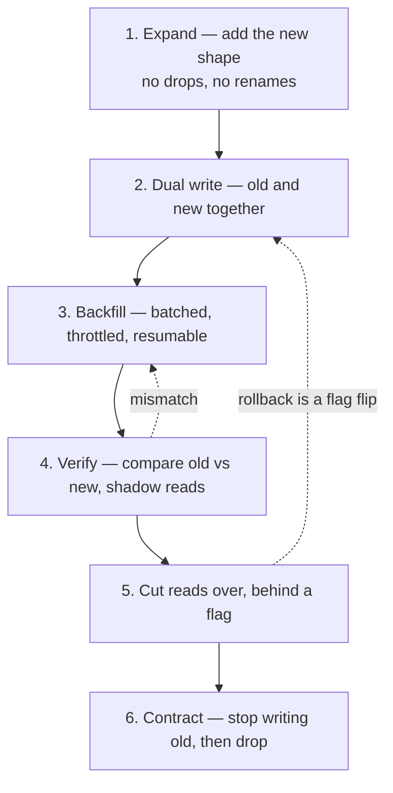

Each numbered step is a separate deploy; the dotted edges are why that matters. Steps 4 and 5 are
the two people skip, and **step 4 is the one interviewers reward** — it is the difference between a
migration plan and a hope.

**Drill:** pick a design you have already done and change its partition key. Write the six steps,
the verification query, and the rollback at each step. Fifteen minutes, and it exposes more than
another new problem would.

---

### Phase LLD — parallel every week

**Two formats — do not mix the deliverable**

| Format | Produce | Typical |
|---|---|---|
| **Whiteboard OOD** | Requirements, 8–15 class boxes, 2–3 methods, trade-offs | 45–60 min (US Amazon/Google/Meta often) |
| **Machine coding** | Compiling in-memory app + driver + review | **90–120 min** + ~30 min review (Flipkart, Uber India, many India product firms; Atlassian **code design** is closer to this) |

Drawing load balancers in LLD (or class diagrams in HLD) is a common miss.

**What “good” looks like**

| Level | Bar |
|---|---|
| Junior | Entities, responsibilities, one diagram, happy path code, basic SOLID |
| Mid | Strategy/state where it earns its keep; concurrency on shared resources; tests for races |
| Senior | Minimal patterns, extension points for the *next two* requirements, lock granularity |
| Staff | Same plus: API between packages, failure modes, observability hooks, “what we would not build”; LLD as **domain/API evolution**, not parking-lot trivia |

**Fundamentals**

- SOLID, DRY, KISS, YAGNI — **name a violation in your own sketch**. Rule of three: a pattern when the **third** variant appears (or they ask for extensibility).
- **Tier-1 patterns:** Strategy, State, Observer, Factory. **Tier-2:** Decorator, Command, Builder, Chain of Responsibility (logger), Template Method, Composite (file tree), Specification (Unix `find`). Singleton only if you can say why DI is usually better.
- UML: class + sequence for the critical path — correct arrows on the **hinge** classes beat complete getters
- Concurrency: thread pools, locks vs CAS, `ConcurrentHashMap` (not Java 7 segments). **Virtual threads ([JEP 444](https://openjdk.org/jeps/444), final in 21):** cheap blocking I/O, not faster CPU; a tiny JDBC pool still bottlenecks. **Scoped values** finalized in JDK 25 ([JEP 506](https://openjdk.org/jeps/506)) — prefer over `ThreadLocal` with millions of VTs. **Structured concurrency is still preview** — sixth preview in JDK 26 ([JEP 525](https://openjdk.org/jeps/525)), not final as of Sep 2026. Do not claim it as a production default on any LTS without `--enable-preview`; see Section 12.
- Machine coding: compiling code > pretty UML; YAGNI on Redis locks for a single-process round- **Boundaries, not just classes:** ports and adapters — domain logic that does not import your HTTP framework or your ORM. The test is whether the core compiles without them ([hexagonal architecture](https://alistair.cockburn.us/hexagonal-architecture/))
- **Domain modelling, lightly:** entity vs value object, aggregate and invariant, the bounded context you are inside. You are not doing full DDD in 45 minutes; you *are* expected to know that `Money` is not a `double` and that an invariant belongs in one place ([Fowler on DDD](https://martinfowler.com/bliki/DomainDrivenDesign.html), [BoundedContext](https://martinfowler.com/bliki/BoundedContext.html))
- **Error modelling is design:** expected-failure return types vs exceptions, which errors are retryable, and error codes a caller can branch on. “Throw a `RuntimeException`” ends a promising round
- **The API between packages is the real LLD at senior+:** what is public, what is sealed, what a caller can depend on. Idempotency keys, pagination and versioning (Phase 4) are LLD questions when they land in a method signature
- **Testability is a design property:** constructor injection over static singletons, a `Clock` you can advance instead of `sleep()`, and a seam to fake the network. If you cannot test the race without timing luck, the design is wrong
- **AI-flavoured LLD is appearing** — design a tokenizer/chunker, a retry-and-fallback model client, a tool registry, an in-memory vector index. It is ordinary OOD with an unfamiliar noun; treat it that way

**What a good class sketch looks like** — interfaces at the seams, one concrete strategy per
variation axis, and the two dependencies that make it testable. Note what is *absent*: no
getters, no DTOs, no base class inherited for reuse.

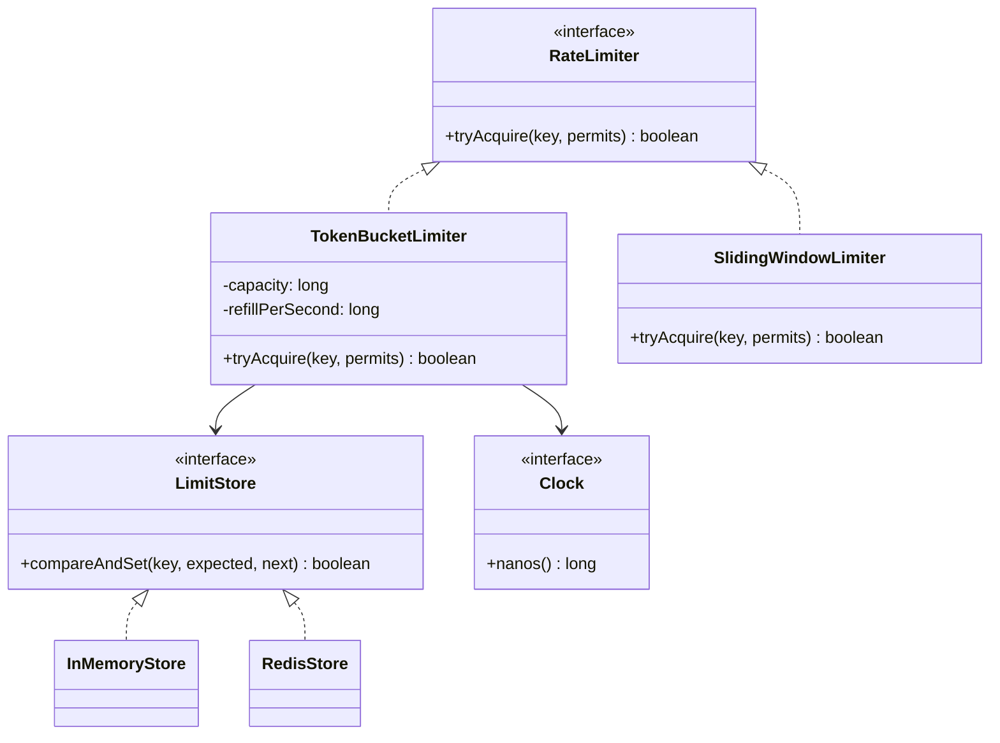

`Clock` is the whole testability argument in one box: with it you can prove the refill logic in
microseconds, and without it your test either sleeps or lies.

**Resources:** [Refactoring.Guru](https://refactoring.guru/design-patterns) • [system-design-primer OOD](https://github.com/donnemartin/system-design-primer) • [ashishps1/awesome-low-level-design](https://github.com/ashishps1/awesome-low-level-design) • [Hello Interview LLD](https://www.hellointerview.com/learn/low-level-design/in-a-hurry/patterns) • [JEP 444](https://openjdk.org/jeps/444)

---

### Phase 11 — Mock intensive

- Self-record against Section 10 rubric; note evidence, not vibes
- You need **another human** for follow-ups (peer, interviewing.io, Exponent, Hello Interview coaches)
- Last week: **taper**. No new frameworks.

---

## 5. Timeboxed interview formats

**30 min:** Requirements 3 → data+API 7 → architecture 10 → 1–2 trade-offs 5 → bottlenecks 3. Skip deep math (2 min max).

**45 min (most common HLD):** Full 7-step at moderate depth: req 5, estimate 5, API 5, data 5, diagram 15, failure/trade-off 7, summary 3.

**60 min staff/deep dive:** Same, but one component for 15+ minutes. **Name the follow-up before they ask** (“on leader death…”).

**LLD 45–60 min:** Clarify 3–5 min → nouns/variation axes 5 → diagram 10 → code `park()`/`book()`/`split()` 15–20 → concurrency/OCP 5–10.

**Machine coding 90–120 min:** Working driver, in-memory, demo; patterns + races in the review.

**AI HLD 45 min:** Requirements (latency, cost cap, hallucination policy, data sensitivity) 7 → pipeline diagram 10 → retrieval **or** serving deep dive 15 → evals + fallback + observability 8 → summary 5.

**Agent / AI-systems round 45 min** (senior+ at AI-product companies): requirements including
the **irreversible actions** 7 → tools and their contracts 8 → the loop with its budgets and
terminal states 10 → authz and prompt injection as an escalation path 8 → evals, cost ceiling and
kill switch 7 → summary 5. The graded question is *what stops this thing*, not what it can do.

**Architecture review / written doc (Stage 5, 60–90 min):** you present a system you actually
built. Ten minutes of context, then the room attacks. Budget: constraints and what you optimised for
10 → the two or three real decisions with their rejected alternatives 20 → what broke in production
and what you changed 15 → what you would do differently and what you would delete 10 → org and
ownership 10. There is no clean framework for this format; the preparation is the writing (2.5).

---

## 6. Master HLD problem list (by complexity and book coverage)

Do **depth on a subset**. Numbers in parentheses: Xu volume.

**Foundational (junior+):**

1. URL shortener (V1.8) 2. Rate limiter (V1.4) 3. Unique ID generator (V1.7) 4. Key-value / cache (V1.5–6) 5. Web crawler (V1.9)

**Intermediate:**

6. News feed (V1.11) 7. Notifications (V1.10) 8. Chat (V1.12) 9. Autocomplete (V1.13) 10. Ride-sharing dispatch 11. Proximity / “nearby” (V2.1–2) 12. Distributed message queue (V2.4) 13. Metrics & alerting (V2.5) 14. Leaderboard (V2.10) 15. Multi-tenant rate-limited API platform 16. Job scheduler 17. Ticketmaster / booking (HLD) 18. Matching apps (Tinder-style) — Hello Interview medium rotation 19. Distributed lock / lease service (fencing tokens — Phase 1) 20. Idempotent webhook delivery (retries, ordering, DLQ)

**Advanced:**

21. Drive / file sync (V1.15) 22. Object storage S3-like (V2.9) 23. Search 24. YouTube / streaming (V1.14) 25. Maps (V2.3) 26. Ad click aggregation (V2.6) 27. Hotel reservation (V2.7) 28. Payments (V2.11) 29. Digital wallet (V2.12) 30. Email (V2.8) 31. Multi-region checkout + inventory 32. Collaborative editing (OT/CRDT) 33. Global CDN 34. Real-time analytics dashboard (stream → OLAP, freshness SLA — Phase 3b) 35. Multi-tenant SaaS on cells (isolation, quotas, blast radius — Phase 6b) 36. Migrate a 4-billion-row table with no downtime (the design *is* the migration — Phase 10) 37. Feature store + embedding pipeline (batch and nearline)

**Staff-signal / 2026 AI + infra:**

38. LLM serving at scale (batching, KV cache, GPU, fallback) 39. RAG support chatbot (hybrid retrieval, evals, PII) 40. Semantic search / hybrid index 41. Copilot / agent with tools (authz, loop limits, kill switch) 42. Recsys with two-tower / embeddings + ranker 43. Distribute model weights under bandwidth caps 44. Stock exchange matching (V2.13) 45. Realtime gaming presence + leaderboard 46. Eval platform for many agent workflows (golden sets, judges, CI gate — Phase AI) 47. AI gateway (token quotas per tenant, routing, semantic cache, audit) 48. Text-to-SQL over a warehouse (schema grounding, safety, cost per query) 49. Prompt/model deployment platform (one versioned artifact, canary, rollback)

### 6.1 One worked sketch — the altitude to aim for

Diagrams are graded on *altitude*, not completeness: boxes an interviewer can interrogate, arrows
with a protocol, and one visible decision. This is a hybrid-fan-out feed (problem 6), which is worth
drawing once because it contains the most reusable decision in the list — **precompute or compute on
read, and what you do about the outlier that breaks your choice**.

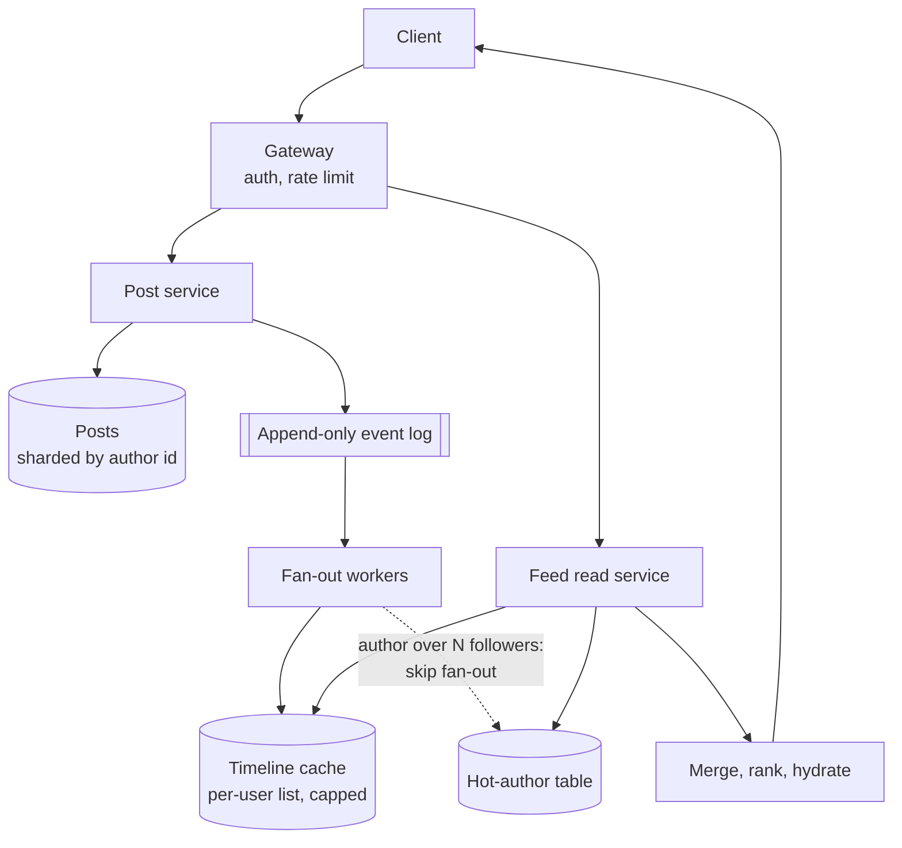

What makes it answerable rather than decorative:

- **The dotted edge is the design.** Fan-out on write is cheap to read and catastrophic for a
  celebrity; the hot-author path is the admission that one strategy does not cover the distribution.
  N is a number you should be able to defend from Phase 1b arithmetic
- **The cap on the timeline cache** is where cost lives. State it, and state what happens on a miss
- **The event log** is what makes rebuild possible after a fan-out bug — which is Phase 10's
  backfill question hiding in a feed design
- **Failure sentence, unprompted:** if fan-out workers lag, reads degrade to merge-on-read for
  recent posts and the user sees a staler feed, not an error

Do this for two or three problems in your own hand. Copying this diagram is worth nothing; deriving
it is the entire skill.

---

## 7. Master LLD / OOD problem list

**Junior:** Parking lot • Vending machine • Library (Book vs **BookCopy**) • Logger • LRU cache • Tic-tac-toe / snake & ladder • Meeting scheduler (data model)

**Mid:** Elevator (SCAN/LOOK, hall vs cabin) • Movie booking (seat locks) • ATM / banking • Hotel booking (inventory) • Splitwise • In-memory rate limiter • Pub-sub • Thread pool • HashMap internals (Java) • Connection pool • Amazon locker • Unix `find` (Specification + walker) • Retry scheduler with backoff and jitter • Idempotency-key store (TTL, in-flight vs completed) • Feature-flag SDK (evaluation, targeting, no network on the hot path)

**Senior:** Chess • Distributed cache library (not cluster) • Notification dispatcher • Ride matching (in-process) • File system (Composite) • Copy-on-write document • Parking + EV/charging (OCP) • Payment processor LLD (idempotency) • Circuit-breaker library (state machine + clock seam) • Metrics registry (counter, gauge, histogram; label cardinality) • Undo/redo with Command + Memento on a real editor model

**AI-flavoured LLD** (ordinary OOD with unfamiliar nouns, asked at AI-product companies): Tool registry for an agent (registration, schema, allowlist, dispatch) • Text chunker (strategy per document type, overlap, metadata) • Model client with timeout, retry, fallback chain and token accounting • In-memory vector index (brute-force kNN, then a filter predicate)

**Concurrency-heavy:** Ticket booking • Producer-consumer blocking queue • Web crawler worker pool (LLD) • Bounded worker pool with graceful shutdown (drain, in-flight completion, no lost task)

For each: class diagram, sequence for the hottest path, compiling code, tests that **fail if you remove the lock**.

---

## 8. Why experienced engineers fail (2026)

1. No trade-offs stated. 2. Skip scoping. 3. Capacity math unused. 4. “Add servers” with no cost. 5. Over-engineering (active-active, ES, NewSQL) without need. 6. No ops (SLO, rollback, on-call). 7. Shallow data model. 8. Weak failure/degraded path. 9. Not driving (senior→staff gap). 10. Silent on AI when the product is clearly ML/LLM. 11. (Java) Spring trivia instead of architecture. 12. (Junior) Patterns as wallpaper. 13. (AI round) No evals, no token cost, no hallucination policy. 14. No change story — a design that cannot be migrated, backfilled or rolled back. 15. Blast radius never bounded — cannot say who the worst failure reaches. 16. An agent with no kill switch, step budget or authz boundary. 17. Dated vocabulary — ZooKeeper-era Kafka, “Redis” with no awareness of the fork, sidecar-only mesh.

---

## 9. Junior vs senior vs staff vs architect signals

| Signal | Junior | Senior | Staff | Architect |
|---|---|---|---|---|
| Requirements | Asks when prompted | Clarifies NFRs | Scopes in/out unprompted | Questions whether the problem is the right one |
| Trade-offs | Names two options | Defends a choice | Surfaces cost/ops first | Writes the decision down with the rejected option |
| Scale | Knows cache + replica | Designs from numbers | Questions the numbers | Sets the budget the numbers must fit |
| Failure | Retries | Named patterns | Thresholds, fallback, test | Bounds blast radius; accepts a known risk explicitly |
| AI | “Call OpenAI” | RAG + cache + fallback | Serving, evals, GPU $, safety | Build vs buy, vendor risk, where AI must not go |
| Org | — | Mentions teams | Contracts, blast radius | Designs the boundaries and who is paged |
| Change | — | Ships a migration | Sequences a migration and rolls back | Owns a multi-year path and the deletion date |

---

## 10. Mock scoring rubric (1–5)

| Dimension | 1 | 3 (solid senior / strong mid) | 5 (staff) |
|---|---|---|---|
| Requirements | Jumped in | Good clarifying Qs | Scoped + non-obvious constraints |
| Estimation | Skipped | Math once | Numbers drive choices |
| Data model | “A database” | Schema + index | Access patterns + partition key |
| APIs | Missing | Clean REST/RPC | Versioning, idempotency, pagination |
| Trade-offs | None | When asked | Proactive + cost/ops |
| Reliability | None | Named patterns | Threshold + fallback + test |
| AI (if relevant) | Ignored | Boxes for retrieve+generate | Eval, cost, GPU, safety |
| Communication | Passive | Structured | Drove time + summary |

**These eight dimensions are fixed.** They are the schema the `mock-interviewer`
and panel agents write into `mocks/*.md` frontmatter (`ratings:` keys, documented in
`mocks/README.md`), so adding a dimension here would silently break every score trend already
recorded. Score the newer material *inside* the existing dimensions instead:

- Phase 10 (migration, backfill, rollback) → **Reliability** and **Data model**
- Phase 6b (cells, tenancy, blast radius) → **Reliability** and **Trade-offs**
- Phase 2b (transport, timeout budgets) → **Trade-offs**, or **APIs** when it lands in a contract
- Phase 3b (analytics, lakehouse) → **Data model**
- Phase AI agents, evals and cost model → **AI**

If a future round genuinely needs its own dimension, add it to `mocks/README.md` in the same commit
or the Mock avg column stops meaning anything.

---

## 11. Progress tracker

Record your **stage** (2.0) and your **actual weekly hours** at the top — 2.6's arithmetic is
worthless against hours you did not really work.

**Stage:**    **Target level:**    **Hours/week (actual, 4-week mean):**    **Loop date:**

| Phase | Status | Weak spots | Mock avg | Revisit |
|---|---|---|---|---|
| 0 Interview OS | ☐ | | | |
| 1 Distributed fundamentals | ☐ | | | |
| 1b Scale, cache, IDs | ☐ | | | |
| 2 Data layer | ☐ | | | |
| 2b Networking / transport | ☐ | | | |
| 3 Messaging / derived data | ☐ | | | |
| 3b Analytics / lakehouse *(first cut)* | ☐ | | | |
| 4 API / edge | ☐ | | | |
| 5 Reliability | ☐ | | | |
| 6 Multi-region / cost | ☐ | | | |
| 6b Cells / tenancy / blast radius | ☐ | | | |
| 7 Observability | ☐ | | | |
| 8 Security | ☐ | | | |
| AI Basic / Int / Adv | ☐ / ☐ / ☐ | | | |
| AI Agents / Evals / Cost model | ☐ / ☐ / ☐ | | | |
| 9 Specializations | ☐ | | | |
| 10 Evolution / change safety | ☐ | | | |
| LLD | ☐ | | | |
| Mocks | ☐ | | | |
| Stage 5 packet *(architect only)* | ☐ | | | |

**Mock avg** is the mean of `score` in `mocks/*.md`, filtered to one level and one `round_type`,
counting each panel loop **once** via the packet's `loop_score` — the rules are in
`mocks/README.md`. Averaging seat scores in alongside single-round mocks weights one candidate five
times over.

---

## 12. Appendix — verified current-state (as of 26 Sep 2026)

- **Kafka:** KRaft-only from **4.0.0** (announced 18 Mar 2025); the current line is **4.2.0 (17 Feb 2026)** and **4.3.0 (22 May 2026, 25 KIPs)** — [4.2](https://kafka.apache.org/blog/2026/02/17/apache-kafka-4.2.0-release-announcement/), [4.3](https://kafka.apache.org/blog/2026/05/22/apache-kafka-4.3.0-release-announcement/). ZK clusters migrate via the 3.9.x bridge *before* 4.x ([upgrade notes](https://kafka.apache.org/40/getting-started/upgrade/)); a dedicated controller quorum is the usual production topology. “4.0 is KRaft-only” is correct; “4.0 is current” is not.
- **Kafka consumer groups:** [KIP-848](https://cwiki.apache.org/confluence/x/HhD1D) moves rebalance coordination to the broker with server-side assignors; **GA in 4.0 but opt-in**, with the classic protocol deprecated in 4.3 and the default switch targeted at 5.0. Client-side assignors are not implemented. Correct 2026 phrasing: incremental, broker-coordinated — not “stop-the-world”.
- **Redis / Valkey — the fork is permanent and you should name it:** Redis Ltd. left BSD in **March 2024** (RSALv2 / SSPLv1); the Linux Foundation launched **Valkey** (BSD-3, forked from Redis 7.2.4) within the week, backed by AWS, Google Cloud, Oracle, Ericsson and Snap ([announcement](https://www.linuxfoundation.org/press/linux-foundation-launches-open-source-valkey-community)). Redis Ltd. added **AGPLv3** from Redis 8.0 in **May 2025** ([Redis](https://redis.io/blog/agplv3/), [InfoQ](https://www.infoq.com/news/2025/05/redis-agpl-license)). Both are alive; managed “Redis-compatible” services are increasingly Valkey, and AGPL is a blocker for some legal teams. Adoption figures in vendor surveys vary widely — treat any single percentage as marketing, not data.
- **PostgreSQL:** **18** released 25 Sep 2025 (new async I/O subsystem); 18.x is the stable line through 2026, with 19 in beta. Still the correct default answer before distributed SQL. [Release](https://www.postgresql.org/about/news/postgresql-18-released-3142/).
- **Apache Iceberg:** **v3** (deletion vectors, row lineage, `VARIANT`) reached GA across Snowflake, Databricks and S3 Tables during 2026, and open engines default to Iceberg for the analytical copy. [Spec](https://iceberg.apache.org/spec/); [Databricks](https://www.databricks.com/blog/next-era-open-lakehouse-apache-icebergtm-v3-public-preview-databricks).
- **DDIA 2nd edition:** Kleppmann + Riccomini, **O'Reilly, March 2026** — confirmed published, not a pre-release ([author's post](https://martin.kleppmann.com/2026/03/24/designing-data-intensive-applications-2e.html)). Chapter numbering differs from 1e; map by topic (Section 3.3).
- **Java:** virtual threads final in 21 ([JEP 444](https://openjdk.org/jeps/444)); scoped values final in 25 ([JEP 506](https://openjdk.org/jeps/506)); **structured concurrency is still preview** — sixth preview in JDK 26 ([JEP 525](https://openjdk.org/jeps/525)), not final as of Sep 2026. Claiming it as a production default is a dated-sounding error in the other direction.
- **MCP:** donated by Anthropic to the **Agentic AI Foundation** under the Linux Foundation in **December 2025**; the **2026-07-28** specification removes the initialize handshake and session IDs, making the protocol stateless per call ([spec](https://modelcontextprotocol.io/specification/2026-07-28)). Interview framing: an MCP server is an untrusted dependency behind authz and quotas.
- **Ingress vs Gateway API:** the Kubernetes **Ingress API is feature-frozen but not deprecated**; the community **ingress-nginx** controller reached end-of-life in **March 2026**, which is what people actually mean when they say “Ingress is dead”. New traffic-management work is in Gateway API (Envoy Gateway, Istio ambient, Cilium, Kong). Keep those two facts apart.
- **OpenTelemetry:** CNCF **graduated** 11 May 2026; public announcement 21 May 2026. Default interview vocabulary is OTLP, not a vendor SDK.
- **Service mesh — do not mix surveys:**
  - CNCF **Annual Survey 2024**: mesh in production for a few/most apps **~50% (2023) → ~42% (2024)** among *organizations* ([Linux Foundation / CNCF annual survey PDF](https://www.linuxfoundation.org/hubfs/Research%20Reports/cncf_annual_survey24_031225a.pdf)).
  - CNCF **State of Cloud Native Development Q3 2025**: *developer* service-mesh use **18% (Q3 2023) → 8% (Q3 2025)** ([report PDF](https://www.cncf.io/wp-content/uploads/2025/11/cncf_report_stateofcloud_111025a.pdf)), with cost/complexity and meshes folding into platform layers as explanations.
  - Interview takeaway is unchanged: **justify a mesh**; sidecar vs ambient (Istio) vs eBPF (Cilium) is secondary.
- **Gateway API:** GA; Envoy Gateway / Istio typically high conformance. AI gateways exist for token metering — emerging, not a default box on every diagram.
- **Distributed SQL:** No single winner; premature adoption is the usual mistake.
- **LLM serving:** prefill/decode **disaggregation** moved from paper to production during 2025–2026 — [DistServe (OSDI 2024)](https://www.usenix.org/conference/osdi24/presentation/zhong-yinmin) for the idea, [PyTorch + vLLM at Meta scale](https://pytorch.org/blog/disaggregated-inference-at-scale-with-pytorch-vllm/) for the engineering, and [vLLM's own docs](https://docs.vllm.ai/en/latest/features/disagg_prefill/), which still label it experimental and require prefill and decode workers to agree on KV layout, page size, dtype and attention variant. Propose it only with an SLO justification; the KV transfer becomes your new critical path.
- **Interview logistics:** Some firms have tightened in-person / no-AI-tooling rules. The 45–60 min collaborative HLD is still the core format. Grading weights cost, ops, and AI-adjacent literacy more than in 2021.

---

## 13. Canonical resource index

**Books:** Xu Vol. 1 & 2; Kleppmann DDIA (1e, or 2e by topic — Section 3.3); Google SRE book (free); Ilya Grigorik, [*High Performance Browser Networking*](https://hpbn.co/) (free, Phase 2b); Chip Huyen, [*AI Engineering*](https://huyenchip.com/books/) (O'Reilly 2025 — the AI-systems companion to this document) and *Designing Machine Learning Systems*. **Architect stage (2.5):** Ford, Richards, Sadalage & Dehghani, *Software Architecture: The Hard Parts* (O'Reilly 2021, ISBN 9781492086895); Skelton & Pais, [*Team Topologies*](https://teamtopologies.com/book); Gregor Hohpe, [*The Software Architect Elevator*](https://architectelevator.com/book/).

**Open primers:** [donnemartin/system-design-primer](https://github.com/donnemartin/system-design-primer) • [ashishps1/awesome-system-design-resources](https://github.com/ashishps1/awesome-system-design-resources) • [Hello Interview — in a hurry](https://www.hellointerview.com/learn/system-design/in-a-hurry/introduction) • [Hello Interview practice catalog](https://www.hellointerview.com/practice/system-design) • [ByteByteGo](https://blog.bytebytego.com/) • [DesignGurus](https://www.designgurus.io/system-design-interview) • [interviewing.io HLD guide](https://interviewing.io/guides/system-design-interview)

**Company engineering:** [Netflix Tech Blog](https://netflixtechblog.com/) • [Uber Engineering](https://www.uber.com/blog/engineering/) • [Meta Engineering](https://engineering.fb.com/) • [Google Research / SRE](https://sre.google/) • [AWS Architecture Blog](https://aws.amazon.com/blogs/architecture/) • [Stripe blog](https://stripe.com/blog) • [LinkedIn Engineering](https://www.linkedin.com/blog/engineering) • [Airbnb Engineering](https://medium.com/airbnb-engineering) • [Cloudflare Blog](https://blog.cloudflare.com/) (Durable Objects: [docs](https://developers.cloudflare.com/durable-objects/)) • [Databricks Blog](https://www.databricks.com/blog) • [Snowflake blog](https://www.snowflake.com/blog/)

**Reliability and operations — primary sources, not summaries:** the [**AWS Builders' Library**](https://aws.amazon.com/builders-library/) is the single highest-value free resource in this index. Start with [timeouts, retries and backoff with jitter](https://aws.amazon.com/builders-library/timeouts-retries-and-backoff-with-jitter/), [load shedding](https://aws.amazon.com/builders-library/using-load-shedding-to-avoid-overload/), [shuffle sharding](https://aws.amazon.com/builders-library/workload-isolation-using-shuffle-sharding/), [avoiding fallback](https://aws.amazon.com/builders-library/avoiding-fallback-in-distributed-systems/), [caching challenges](https://aws.amazon.com/builders-library/caching-challenges-and-strategies/), [constant work](https://aws.amazon.com/builders-library/reliability-and-constant-work/) and [static stability](https://aws.amazon.com/builders-library/static-stability-using-availability-zones/) • [cell-based architecture whitepaper](https://docs.aws.amazon.com/wellarchitected/latest/reducing-scope-of-impact-with-cell-based-architecture/reducing-scope-of-impact-with-cell-based-architecture.html)

**Change safety and testing:** [Fowler — ParallelChange](https://martinfowler.com/bliki/ParallelChange.html) • [StranglerFigApplication](https://martinfowler.com/bliki/StranglerFigApplication.html) • [gh-ost](https://github.com/github/gh-ost) • [deterministic simulation testing](https://antithesis.com/docs/resources/deterministic_simulation_testing/) • [FoundationDB testing](https://apple.github.io/foundationdb/testing.html) • [WarpStream on DST](https://www.warpstream.com/blog/deterministic-simulation-testing-for-our-entire-saas) • [adr.github.io](https://adr.github.io/)

**AI engineering:** [Anthropic Engineering](https://www.anthropic.com/engineering) — [building effective agents](https://www.anthropic.com/engineering/building-effective-agents), [writing tools for agents](https://www.anthropic.com/engineering/writing-tools-for-agents), [effective context engineering](https://www.anthropic.com/engineering/effective-context-engineering-for-ai-agents), [contextual retrieval](https://www.anthropic.com/engineering/contextual-retrieval) • [vLLM docs](https://docs.vllm.ai/) • [PyTorch blog](https://pytorch.org/blog/) • [MCP spec](https://modelcontextprotocol.io/specification/2026-07-28) • [Hamel Husain on evals](https://hamel.dev/blog/posts/evals/) • [OWASP LLM Top 10](https://genai.owasp.org/llm-top-10/)

**Individuals / independent:** [Martin Fowler](https://martinfowler.com/) • [Jepsen / Aphyr](https://jepsen.io/) • [Julia Evans](https://jvns.ca/) • [High Scalability](http://highscalability.com/) (incl. Google back-of-envelope post) • [Murat Demirbas](https://muratbuffalo.blogspot.com/) • [Marc Brooker](https://brooker.co.za/blog/) • [Brendan Gregg](https://www.brendangregg.com/)

**Papers:** Dynamo, Raft, Spanner, GFS, TAO, Bigtable, Chubby; recent: [Aurora DSQL — scalable multi-region OLTP (2026)](https://arxiv.org/abs/2607.13276); AI: [PagedAttention](https://arxiv.org/abs/2309.06180), [Orca / continuous batching](https://www.usenix.org/conference/osdi22/presentation/yu), [DistServe — prefill/decode disaggregation](https://www.usenix.org/conference/osdi24/presentation/zhong-yinmin)

**Mocks / question feeds:** [Hello Interview questions](https://www.hellointerview.com/premium/questions) • [interviewing.io](https://interviewing.io/) • [Exponent](https://www.tryexponent.com/) • Glassdoor/Blind *as color, not as answer keys*

**Latest-question hygiene:** Re-check Hello Interview + company blogs **30 days before** your loop. This README’s problem list is the stable core; the long tail moves.

---

## 14. The tooling in this repo

All of it is project-scoped and versioned with the curriculum, so it travels with the repo;
`.claude/README.md` has the file formats and how to add more.

| What | Where | Use it for |
|---|---|---|
| `mock-interviewer` | `.claude/agents/` | One timed round, **or** 10 researched questions with sources, **or** a graded written answer |
| `interview-panel` | `.claude/agents/panel/` | A full loop: five blind seats, then a committee that weights the rounds and returns HIRE / NO HIRE |
| Panel seats | `.claude/agents/panel/` | `panel-hld-architect`, `panel-hld-deepdive`, `panel-lld-design`, `panel-lld-machine-coding`, `panel-bar-raiser` — each usable alone |
| Panel charter | `.claude/docs/panel-charter.md` | The shared contract: turn protocol, evidence-with-quotes rule, the 1–5 scale anchored to Section 10, sealed-scorecard schema |
| Scorecards | `mocks/` | One dated file per round; YAML frontmatter is the machine-readable trend data |
| Daily reading list | `interview-curator/` | A prompt-driven GitHub Action that curates ten current articles across HLD, LLD and AI |

**How this connects to the plan.** Phase 11 says you need another person for follow-ups, and that is
still true — an agent will not replicate an interviewer reading your hesitation. What the agents do
replace is the *bookkeeping*: calibrated question selection, a rubric applied the same way twice, and
a weakness slug that recurs across `mocks/` so you can see the third time you skipped estimation.

**Known gaps, stated rather than implied — the build list, in priority order:**

1. **An AI panel seat.** `mock-interviewer` already carries an AI rubric (pipeline, retrieval-or-serving depth, evals, token and GPU cost, safety) that no panel seat owns, so a full loop cannot grade the dimension Phase AI spends ~50 hours on. `.claude/README.md` has the five steps for adding a seat
2. **`.claude/skills/` is empty.** `link-audit` and `convention-check` are planned. Until they exist, run the checks in `CLAUDE.md` by hand — a link sweep catches real rot, and engineering blogs reorganise URLs constantly
3. **`mocks/` holds no scorecards**, so every “Mock avg” cell in Section 11 is empty by fact rather than by oversight. The trend only starts existing after the third run

---

## 15. Keeping this current

This document is meant to be edited the day something changes, not rewritten once a year. The rules
below are what let it move fast without becoming untrustworthy.

**Where a fact goes.** Anything with a version number, a release date, a licence, a survey figure or
a governance change belongs in **Section 12**, dated, with a primary source. Never inline in a phase
table, where it rots invisibly — phases link to Section 12, they do not duplicate it.

**What to re-check, and when.**

| Trigger | Check | Lands in |
|---|---|---|
| 30 days before a loop | Hello Interview and your target companies' blogs for the current rotation | Sections 6, 13 |
| Major release of Kafka, PostgreSQL, Kubernetes, a JDK LTS | Version, changed defaults, what it deprecated | Section 12 + the affected phase row |
| A licence or governance change | The primary announcement from **both** sides | Section 12 |
| A paper or engineering post that changes the default answer | Whether it replaces a link or merely adds one | Section 13 + the phase table |
| Every quarter | Link sweep for rot; re-read Section 12 top to bottom | Sections 12, 13 |
| After every mock | Weak spots and score | Section 11 tracker, `mocks/` |

**Rules that do not bend.**

- **Primary sources only** for dated claims. Vendor marketing, aggregators and SEO posts are not sources, and a percentage without a methodology is not data — say so in the entry rather than quoting it.
- **Never merge two surveys into one trend line.** The two CNCF service-mesh figures in Section 12 measure *organizations* and *developers*; they stay separate and separately labelled. Apply the same rule to any similar pair.
- **Prefer stable domains** to deep links for engineering blogs, which reorganise URLs constantly.
- **Section 10's eight rubric dimensions are the `mocks/` frontmatter schema.** Changing them invalidates every recorded score, so `mocks/README.md` changes in the same commit or not at all.
- **Cut against Section 2.6's list, never against the fundamentals.** When a phase outgrows its hour budget, 🟧 and 🟨 rows go first; 🟦 rows stay.
- **Add, do not renumber.** New material takes a sub-number (2.0, 6.1), a lettered phase (2b, 3b, 6b) or a new trailing section. Inline references depend on the existing numbers.
- **Every concept row keeps its hour estimate.** Section 2.6 sums the *Time* column to derive the stage budgets; a row without one silently shrinks the total.
- **Books by chapter, papers by primary source.** No links to pirated copies.

**Before you commit.** Render the Markdown — table pipes and the tag legend break silently. Validate
every Mermaid block by rendering it with a mermaid 11.x CLI rather than trusting your eye; GitHub
shows a broken diagram as an error box, and the failure modes look fine in a diff. `CLAUDE.md` has
the exact commands.

---

*Ask for a mock on a named problem, a weak-spot drill, or a design review against the rubric.*
